**🌐[ [中文](JML_API_Reference.md) | English ]**

# JmcModLib STS2 API Reference

Source baseline: JML `1.6.1`. This document is reorganized from the source and does not treat older documentation as authoritative. Common namespace imports:

```csharp
using JmcModLib.Core;
using JmcModLib.Config;
using JmcModLib.Config.UI;
using JmcModLib.Config.Storage;
using JmcModLib.Security;
using JmcModLib.Persistence;
using JmcModLib.UI.PauseMenu;
using JmcModLib.Reflection;
using JmcModLib.Utils;
using JmcModLib.Prefabs;
using JmcModLib.Multiplayer;
```

`ExprHelper` is now in the `JmcModLib.Utils` namespace and is usually brought in automatically by `global using JmcModLib.Utils;`.

---

## 1. Overall JML Lifecycle

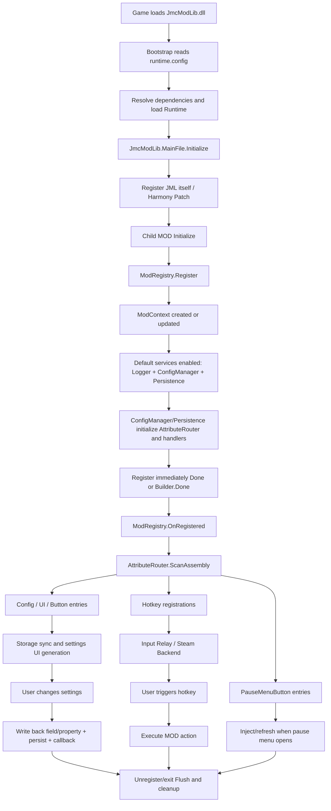

---

## 2. Core: Registration, Context, Runtime Information

### 2.1 Lifecycle Diagram

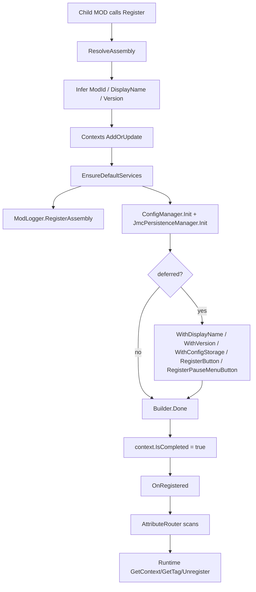

### 2.2 `VersionInfo`

Namespace: `JmcModLib.Core`

| Member | Description |
|---|---|
| `const string Name = "JmcModLib"` | JML name |
| `const string Version = "1.6.1"` | JML version |
| `string Tag` | `"[JmcModLib v1.6.1]"` |
| `GetName(Assembly? assembly = null)` | Gets the specified assembly name; JML itself returns the fixed name |
| `GetVersion(Assembly? assembly = null)` | Gets the specified assembly version; JML itself returns the fixed version |
| `GetTag(Assembly? assembly = null)` | Builds a log tag |

### 2.3 `ModContext`

Namespace: `JmcModLib.Core`

| Property | Type | Description |
|---|---|---|
| `Assembly` | `Assembly` | Current MOD managed assembly |
| `ModId` | `string` | Stable ID, usually equal to manifest `id` |
| `DisplayName` | `string` | Display name used by UI and logs |
| `Version` | `string` | Current registered version |
| `IsCompleted` | `bool` | Whether `Done()` has been triggered to complete registration |
| `LoggerContext` | `string` | Context passed to STS2 logging |
| `Tag` | `string` | Formatted like `[DisplayName v1.0.0]` |

### 2.4 `ModRegistry`

Namespace: `JmcModLib.Core`

| Member | Signature / Default Parameters | Description |
|---|---|---|
| `OnRegistered` | `event Action<ModContext>?` | Fired after a MOD completes registration; AttributeRouter depends on this event |
| `OnUnregistered` | `event Action<ModContext>?` | Fired after a MOD is unregistered |
| `Register` | `Register(string modId, string? displayName = null, string? version = null, Assembly? assembly = null)` | Registers with a manual ID and returns a builder |
| `Register` | `Register(bool deferredCompletion, string modId, string? displayName = null, string? version = null, Assembly? assembly = null)` | Uses a bool to control whether `Done` is deferred |
| `Register` | `Register(bool deferredCompletion, object? modInfo, string? displayName = null, string? version = null, Assembly? assembly = null)` | Reads id/name/version from an anonymous object or metadata object |
| `Register<T>` | `void Register<T>()` | Recommended entry point; completes registration immediately |
| `Register<T>` | `RegistryBuilder? Register<T>(bool deferredCompletion)` | Generic entry point with deferred builder support |
| `Register<T>` | `RegistryBuilder Register<T>(string modId, string? displayName = null, string? version = null)` | Generic entry point with an explicit ID |
| `Register<T>` | `RegistryBuilder? Register<T>(bool deferredCompletion, string modId, string? displayName = null, string? version = null)` | Explicit ID with optional deferral |
| `IsRegistered` | `bool IsRegistered(Assembly? assembly = null)` | Checks whether the Assembly is registered |
| `TryGetContext` | `bool TryGetContext(out ModContext? context, Assembly? assembly = null)` | Tries to get the context |
| `GetContext` | `ModContext? GetContext(Assembly? assembly = null)` | Gets the context |
| `GetModId` | `string GetModId(Assembly? assembly = null)` | Gets the ID; falls back to the Assembly when unregistered |
| `GetDisplayName` | `string GetDisplayName(Assembly? assembly = null)` | Gets the display name |
| `GetVersion` | `string GetVersion(Assembly? assembly = null)` | Gets the version |
| `GetTag` | `string GetTag(Assembly? assembly = null)` | Gets the log tag |
| `Unregister` | `bool Unregister(Assembly? assembly = null)` | Unregisters the context and triggers cleanup |

Recommendation: ordinary child MODs should use `Register<MainFile>()`; shared helpers or cross-Assembly operations should pass `Assembly` explicitly.

### 2.5 `RegistryBuilder`

Namespace: `JmcModLib.Core`

| Method | Default Parameters | Description |
|---|---|---|
| `WithDisplayName(string displayName)` | None | Overrides the display name |
| `WithVersion(string version)` | None | Overrides the version |
| `WithConfigStorage(IConfigStorage storage)` | None | Sets custom storage before scanning |
| `RegisterButton(out string key, string description, Action action, string buttonText = "按钮", string group = ConfigAttribute.DefaultGroup, string? storageKey = null, string? helpText = null, string? locTable = null, string? displayNameKey = null, string? helpTextKey = null, string? buttonTextKey = null, string? groupKey = null, int order = 0, UIButtonColor color = UIButtonColor.Default)` | See signature | Registers a manual button and returns the key |
| `RegisterButton(string description, Action action, ...)` | Same as above | Registers a manual button without retrieving the key |
| `RegisterPauseMenuButton(string key, string text, Action<PauseMenuButtonContext> action, int order = 0, PauseMenuButtonAnchor anchor = PauseMenuButtonAnchor.BeforeExitActions, string? locTable = null, string? textKey = null, Func<PauseMenuButtonContext, bool>? visibleWhen = null, Func<PauseMenuButtonContext, bool>? enabledWhen = null, bool closeMenuOnClick = false, UIButtonColor color = UIButtonColor.Default)` | Also has no-context and async overloads; see the pause menu section | Declares an in-run pause menu button in the current registration chain |
| `Done()` | None | Completes registration and triggers Attribute scanning |

`Done()` may be called repeatedly. The first call triggers the lifecycle; later calls only return the existing context.

### 2.6 `ModRuntime`

Namespace: `JmcModLib.Core`

| Method | Description |
|---|---|
| `TryGetLoadedMod(Assembly? assembly = null)` | Finds the loaded STS2 `Mod` |
| `TryGetManifest(Assembly? assembly = null)` | Finds the manifest corresponding to the current Assembly |
| `GetManifestId(Assembly? assembly = null)` | Manifest `id` |
| `GetPckName(Assembly? assembly = null)` | pck name; falls back to Assembly name on failure |
| `GetDisplayName(Assembly? assembly = null)` | Manifest name or Assembly name |
| `GetLoadedVersion(Assembly? assembly = null)` | Manifest version or Assembly version |
| `FindModById(string modId)` | Finds by exact manifest id |
| `FindLoadedMod(string modId)` | Finds by id/pck/name/assembly name |

---

## 3. Bootstrap / Runtime Loading

### 3.1 Lifecycle Diagram

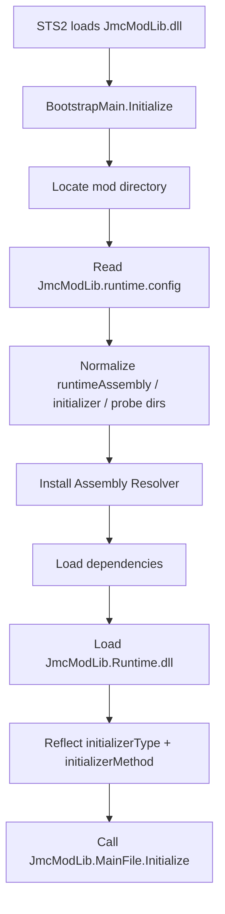

### 3.2 `BootstrapMain`

Namespace: an independent assembly in the Bootstrap project. Ordinary child MODs do not need to call this directly.

| Method | Description |
|---|---|
| `Initialize()` | Called after the game loads the JML Bootstrap; responsible for loading the Runtime |

Key files in the publish directory:

```text
JmcModLib.dll                 # Bootstrap, the dll named by the game manifest
JmcModLib.Runtime.dll         # Runtime referenced by child MODs
JmcModLib.Runtime.xml         # IntelliSense XML
JmcModLib.Sts2.props          # MSBuild reference entry point for child MODs
JmcModLib.runtime.config      # Runtime loading descriptor
Newtonsoft.Json.dll           # Dependency
JmcModLib.pck                 # Godot resource package
JmcModLib.json                # JML manifest
```

Current core fields in `JmcModLib.runtime.config`:

```json
{
  "runtimeAssembly": "JmcModLib.Runtime.dll",
  "initializerType": "JmcModLib.MainFile",
  "initializerMethod": "Initialize",
  "probeDirectories": [".", "lib", "libs"],
  "dependencies": ["Newtonsoft.Json.dll"],
  "probeAllDlls": true
}
```

---

## 4. AttributeRouter: Attribute Scanning and Extension

### 4.1 Lifecycle Diagram

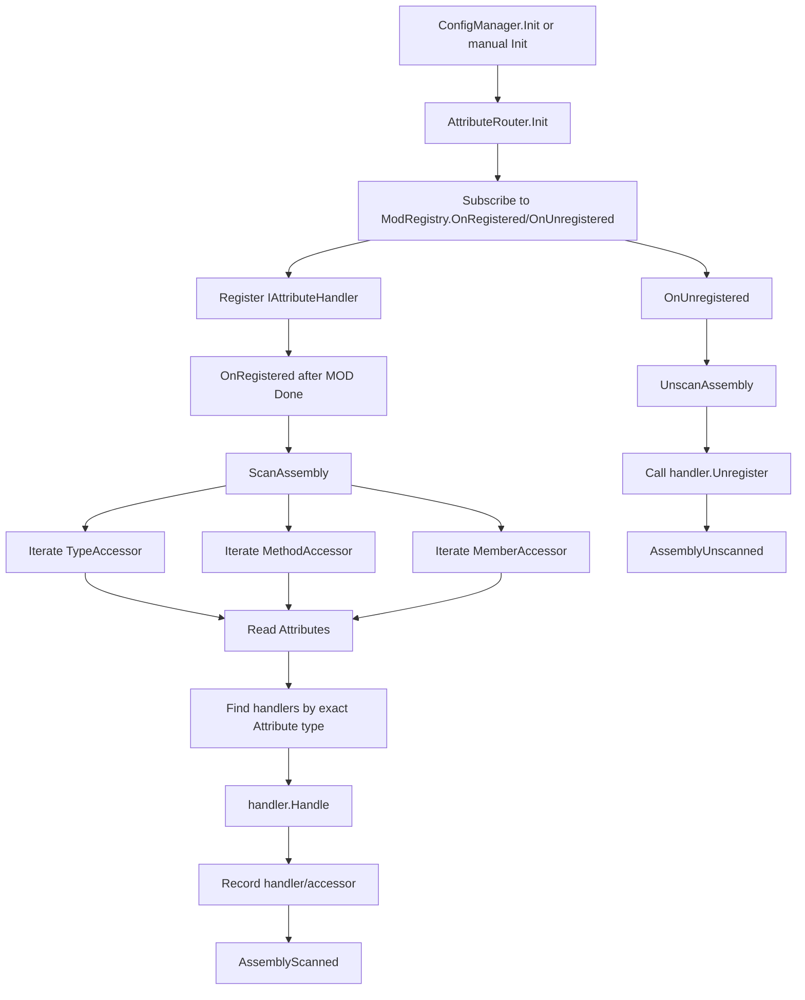

### 4.2 `AttributeRouter`

Namespace: `JmcModLib.Core.AttributeRouter`

| Member | Description |
|---|---|
| `AssemblyScanned` | Scan-completed event |
| `AssemblyUnscanned` | Unscan/unregister-completed event |
| `IsInitialized` | Whether it has been initialized |
| `Init()` | Subscribes to the registration lifecycle |
| `Dispose()` | Unsubscribes events, unscans scanned Assemblies, and clears handlers |
| `RegisterHandler<TAttribute>(IAttributeHandler handler)` | Registers a handler |
| `RegisterHandler<TAttribute>(Action<Assembly, ReflectionAccessorBase, TAttribute> action)` | Registers a simple action handler |
| `UnregisterHandler(IAttributeHandler handler)` | Removes a handler, but does not automatically unscan existing records |
| `ScanAssembly(Assembly assembly)` | Scans an Assembly |
| `UnscanAssembly(Assembly assembly)` | Runs handler unregister callbacks and clears records |

### 4.3 `IAttributeHandler`

| Member | Description |
|---|---|
| `Handle(Assembly assembly, ReflectionAccessorBase accessor, Attribute attribute)` | Handles a discovered Attribute |
| `Unregister` | Optional cleanup callback; parameters are the Assembly and the list of accessors handled by this handler |

### 4.4 `SimpleAttributeHandler<TAttribute>`

Constructor:

```csharp
new SimpleAttributeHandler<TAttribute>(Action<Assembly, ReflectionAccessorBase, TAttribute> action)
```

It only handles the registered type `TAttribute`, and `Unregister` is currently `null`. It is suitable for lightweight extensions, not for extensions that need unload cleanup.

---

## 5. Config: Configuration, Storage, Entries

### 5.1 Lifecycle Diagram

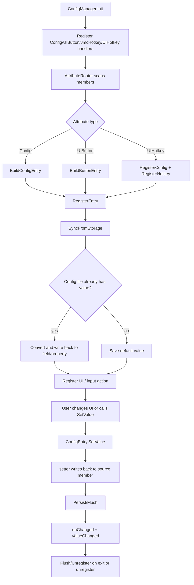

### 5.2 `ConfigAttribute`

Namespace: `JmcModLib.Config`

Constructor:

```csharp
[Config(string displayName, string? onChanged = null, string group = ConfigAttribute.DefaultGroup)]
```

| Member | Default | Description |
|---|---:|---|
| `DefaultGroup` | `"DefaultGroup"` | Default group constant |
| `DisplayName` | Constructor parameter | UI fallback display name |
| `OnChanged` | `null` | Static callback method name |
| `Group` | `DefaultGroup` | Group |
| `Key` | `null` | Storage key; when empty, Attribute registration uses `DeclaringType.FullName.MemberName` |
| `Description` | `null` | Description fallback text |
| `LocTable` | `null` | Localization table; defaults to `settings_ui` when used by the UI layer |
| `DisplayNameKey` | `null` | Display-name localization key |
| `DescriptionKey` | `null` | Description localization key |
| `GroupKey` | `null` | Group localization key |
| `Order` | `0` | Sort order; smaller values come first |
| `RestartRequired` | `false` | Whether to hint that a restart or re-entry flow is needed |
| `IsValidMethod(MethodInfo method, Type valueType, out LogLevel? level, out string? errorMessage)` | Static method | Validates the onChanged callback |

### 5.3 `ConfigManager`

Namespace: `JmcModLib.Config`

| Member | Default / Signature | Description |
|---|---|---|
| `FlushOnSet` | `true` | Flushes immediately after each write |
| `AssemblyRegistered` | event | Event fired after Assembly config entries are registered |
| `AssemblyUnregistered` | event | Assembly config cleanup event |
| `EntryRegistered` | event | Single config entry registration event |
| `ValueChanged` | event | Config value changed event |
| `IsInitialized` | bool | Whether it has been initialized |
| `Init()` | None | Initializes AttributeRouter and default handlers |
| `Dispose()` | None | Clears all config registrations |
| `SetStorage(IConfigStorage storage, Assembly? assembly = null)` | assembly inferred automatically | Sets Assembly storage |
| `GetStorage(Assembly? assembly = null)` | assembly inferred automatically | Gets storage; defaults to Newtonsoft when unset |
| `CreateStorageKey(Type declaringType, string memberName)` | None | Generates `FullName.Member` |
| `CreateKey(string storageKey, string group = ConfigAttribute.DefaultGroup)` | Default group | Generates `group.storageKey` |
| `Flush(Assembly? assembly = null)` | assembly inferred automatically | Flushes to disk |
| `GetEntries(Assembly? assembly = null)` | assembly inferred automatically | Gets entries sorted by order/displayName |
| `GetEntries(string group, Assembly? assembly = null)` | group required | Gets config entries in the specified group |
| `GetGroups(Assembly? assembly = null)` | assembly inferred automatically | Gets group names |
| `TryGetEntry(string key, out ConfigEntry? entry, Assembly? assembly = null)` | assembly inferred automatically | Looks up a config entry |
| `GetValue(string key, Assembly? assembly = null)` | assembly inferred automatically | Gets a value; returns null when not found |
| `SetValue(string key, object? value, Assembly? assembly = null)` | assembly inferred automatically | Sets a value and returns whether it succeeded |
| `ResetAssembly(Assembly? assembly = null)` | assembly inferred automatically | Resets all Assembly config to default values |
| `RegisterConfig<TValue>(...)` | See below | Manually registers config |
| `RegisterButton(...)` | See the button section | Manually registers a button |
| `Unregister(Assembly? assembly = null)` | assembly inferred automatically | Cleans up Assembly config, input actions, and storage |

Full manual config signature:

```csharp
string RegisterConfig<TValue>(
    string displayName,
    Func<TValue> getter,
    Action<TValue> setter,
    string group = ConfigAttribute.DefaultGroup,
    Action<TValue>? onChanged = null,
    UIConfigAttribute? uiAttribute = null,
    string? storageKey = null,
    string? locTable = null,
    string? displayNameKey = null,
    string? groupKey = null,
    string? description = null,
    string? descriptionKey = null,
    int order = 0,
    bool restartRequired = false,
    Assembly? assembly = null)
```

Manual registration is suitable for dynamic config. Production MODs should pass `storageKey` explicitly.

### 5.4 `ConfigEntry` / `ConfigEntry<TValue>`

Namespace: `JmcModLib.Config.Entry`

| Member | Description |
|---|---|
| `Assembly` | Owning Assembly |
| `StorageKey` | Persistence key, without group |
| `Group` | Group |
| `DisplayName` | Fallback display name |
| `Key` | `CreateKey(StorageKey, Group)` |
| `Attribute` | Config metadata |
| `UIAttribute` | UI metadata, may be null |
| `DropdownOptionsProviderAttribute` | Dynamic dropdown provider metadata, may be null |
| `VisibleWhenAttribute` | Dynamic visibility metadata, may be null |
| `SourceDeclaringType` | Attribute source type, may be null |
| `SourceMemberName` | Attribute source member name, may be null |
| `ValueType` | Value type |
| `DefaultValue` | Default value |
| `GetValue()` | Reads the current source value |
| `SetValue(object? value)` | Converts and sets the value |
| `Reset()` | Resets to the default value |
| `ValueChanged` | Entry-level change event |
| `CreateStorageKey(Type declaringType, string memberName)` | Static key generation |
| `CreateKey(string storageKey, string group = DefaultGroup)` | Full key generation |

Additional members on `ConfigEntry<TValue>`:

| Member | Description |
|---|---|
| `DefaultValueTyped` | Strongly typed default value |
| `GetTypedValue()` | Strongly typed read |
| `SetTypedValue(TValue value)` | Strongly typed set |

### 5.5 `IConfigStorage`

Namespace: `JmcModLib.Config.Storage`

| Method | Description |
|---|---|
| `GetFileName(Assembly? assembly = null)` | Gets the file name |
| `GetFilePath(Assembly? assembly = null)` | Gets the full path |
| `Exists(Assembly? assembly = null)` | Whether the file exists |
| `Save(string key, string group, object? value, Assembly? assembly = null)` | Saves to cache and marks dirty |
| `TryLoad(string key, string group, Type valueType, out object? value, Assembly? assembly = null)` | Tries to read and deserialize |
| `Flush(Assembly? assembly = null)` | Writes to disk |

### 5.6 `NewtonsoftConfigStorage` / `JsonConfigStorage`

Constructors:

```csharp
new NewtonsoftConfigStorage(string? rootDirectory = null)
new JsonConfigStorage(string? rootDirectory = null)
```

Both implement `IConfigStorage`. When the default root is empty, `OS.GetUserDataDir()/mods/config` is used. The default storage is `NewtonsoftConfigStorage`, which is more tolerant of complex types; `JsonConfigStorage` is lighter, but compatibility with complex types needs extra validation.

### 5.7 SecretStore

Namespace: `JmcModLib.Security`

SecretStore is for sensitive text such as API keys, tokens, and webhook URLs. A Secret appears in the JML settings page like a config entry, but it is not normal Config: it is not written through `NewtonsoftConfigStorage` / `JsonConfigStorage`, it does not enter the normal config JSON, and it is not persisted through `IConfigStorage`. The settings page only shows status plus set/update and clear actions.

#### Attribute Declaration

```csharp
using JmcModLib.Security;

[Secret(
    "llm.api_key",
    Group = "secrets",
    DisplayNameKey = "EXTENSION.MYMOD.SECRET.api_key.NAME",
    DescriptionKey = "EXTENSION.MYMOD.SECRET.api_key.DESCRIPTION",
    SetButtonTextKey = "EXTENSION.MYMOD.SECRET.api_key.SET_BUTTON",
    ClearButtonTextKey = "EXTENSION.MYMOD.SECRET.api_key.CLEAR_BUTTON",
    GroupKey = "EXTENSION.MYMOD.GROUP.secrets",
    Order = 10)]
internal static readonly JmcSecretSlot ApiKey = new();
```

If one Secret key must be separated by provider, account, or environment, declare a static parameterless `string` method or property on the same type and point `ScopeProvider` at it:

```csharp
[Secret("llm.api_key", ScopeProvider = nameof(GetProviderScope))]
internal static readonly JmcSecretSlot ApiKey = new();

private static string GetProviderScope() => CurrentProvider;
```

#### Builder Registration

```csharp
ModRegistry.Register<MainFile>(true)?
    .RegisterSecret(
        out JmcSecretSlot apiKey,
        "llm.api_key",
        new JmcSecretOptions
        {
            Group = "secrets",
            DisplayName = "API Key",
            Description = "Used for the current provider.",
            ScopeProvider = () => CurrentProvider,
            Order = 10
        })
    .Done();
```

You can also pass a slot created by the caller:

```csharp
private static readonly JmcSecretSlot ApiKey = new();

ModRegistry.Register<MainFile>(true)?
    .RegisterSecret(ApiKey, "llm.api_key", new JmcSecretOptions { Group = "secrets" })
    .Done();
```

#### Read, Save, and Delete

Normal business code should prefer the slot:

```csharp
if (!ApiKey.TryRead(out string apiKey, out JmcSecretReadStatus status))
{
    ModLogger.Warn($"API Key unavailable: {status}");
    return;
}

// Drop apiKey as soon as possible; never log it, throw it, show it in status text, or copy it to the clipboard.
```

Advanced scenarios can use the static store:

```csharp
bool ok = JmcSecretStore.TryRead(
    "llm.api_key",
    out string value,
    out JmcSecretReadStatus status,
    scope: CurrentProvider);
```

Public API:

| Type / Member | Description |
|---|---|
| `SecretAttribute` | Declares a static `JmcSecretSlot` field or property; supports display text, button text, group, dynamic scope, weak-protection opt-in, and order |
| `JmcSecretSlot` | Slot handle held by child MODs; exposes `TryRead`, `TrySave`, `TryDelete`, `Exists`, and `ProtectionLevel` |
| `JmcSecretOptions` | Display, localization, scope, and weak-protection options for manual registration |
| `JmcSecretStore` | Advanced static entry point for key/scope/assembly-based read, save, delete, and existence checks |
| `JmcSecretProtectionLevel` | Protection levels such as `SystemKeychain`, `UserProfileProtected`, `WeakFileProtection`, `SessionOnly`, and `Unavailable` |
| `JmcSecretReadStatus` | `Success`, `Missing`, `Unavailable`, `AccessDenied`, `DecryptionFailed`, `BackendError` |
| `JmcSecretWriteStatus` | `Success`, `Unavailable`, `AccessDenied`, `WeakProtectionNotAllowed`, `BackendError` |
| `RegistryBuilder.RegisterSecret(...)` | Manually registers a Secret settings row during the registration chain |

#### Platform Protection Levels

| Platform / Condition | First-version behavior |
|---|---|
| Windows | Uses current-user DPAPI; protection level is `UserProfileProtected` |
| Non-Windows by default | Returns `Unavailable` or `WeakProtectionNotAllowed`; no unhandled exception |
| Explicit `AllowWeakFileProtection = true` | Can save through weak file protection; protection level is `WeakFileProtection` |

Weak file protection only attempts to restrict file permissions; it is not secure encryption. Do not use it for shared devices or high-value secrets, and make the risk clear in docs, UI, and logs. With any backend, business code must never log plaintext Secret values. Also remember that a read `string` cannot truly be zeroed in .NET.

### 5.8 Persistence: Non-Config Persistence

Namespace: `JmcModLib.Persistence`

Persistence is separate from `ConfigManager`. It stores data that is not a settings entry: current-machine local preferences, account-wide global data, current-profile data, and local non-synced current-run data. It reuses `AttributeRouter` to scan static fields/properties, but it does not create settings UI.

```csharp
using JmcModLib.Persistence;

internal sealed class Stats
{
    public int TotalRuns { get; set; }
    public List<string> Notes { get; set; } = [];
}

internal sealed class RunState
{
    public int RoomsVisited { get; set; }
}

internal sealed class PanelState
{
    public string LastTab { get; set; } = "overview";
    public bool IsCollapsed { get; set; }
}

internal sealed class ClientRunUiState
{
    public bool OverlayPinned { get; set; }
    public ulong? LockedNetId { get; set; }
}

internal static class DemoPersistence
{
    [JmcLocalPreference("ui.panel_state")]
    internal static readonly JmcDataSlot<PanelState> PanelState = new(new PanelState());

    [JmcClientRunData("ui.client_overlay_state")]
    internal static readonly JmcRunDataSlot<ClientRunUiState> ClientOverlayState = new(new ClientRunUiState());

    [JmcGlobalData("stats.global_launches")]
    internal static int GlobalLaunches;

    [JmcProfileData("stats")]
    internal static readonly JmcDataSlot<Stats> Stats = new(new Stats());

    [JmcProfileData("stats.total_runs")]
    internal static int TotalRuns;

    [JmcRunData("run_state")]
    internal static readonly JmcRunDataSlot<RunState> RunState = new(new RunState());

    public static void RecordRunStart()
    {
        GlobalLaunches++;
        TotalRuns++;
        Stats.Modify(static stats => stats.TotalRuns++);
        JmcPersistenceManager.Flush();
    }

    public static void TogglePanel()
    {
        PanelState.Modify(static state =>
        {
            state.IsCollapsed = !state.IsCollapsed;
            state.LastTab = state.IsCollapsed ? "compact" : "overview";
        });
    }

    public static void ToggleClientOverlay()
    {
        ClientOverlayState.Modify(static state =>
        {
            state.OverlayPinned = !state.OverlayPinned;
            state.LockedNetId = 123;
        });
    }

    public static void RecordRoomVisited()
    {
        RunState.Modify(static state => state.RoomsVisited++);
    }
}
```

Lifecycle:

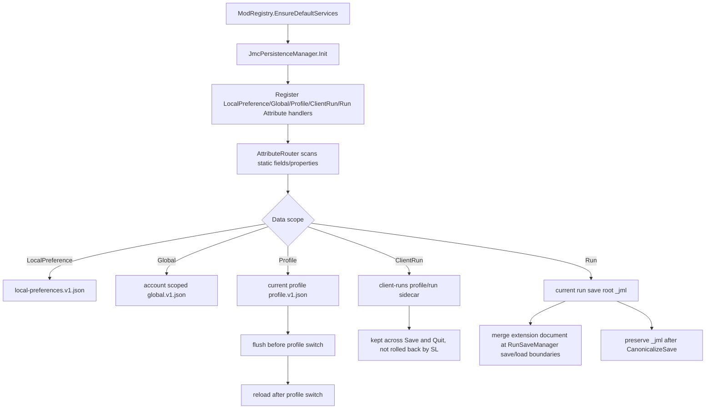

Public API:

| Type / Member | Description |
|---|---|
| `JmcLocalPreferenceAttribute` | Declares current-machine local preferences; does not switch with profile, does not enter run saves, and does not participate in cloud or multiplayer sync |
| `JmcGlobalDataAttribute` | Declares account-scoped data that does not switch with profile |
| `JmcProfileDataAttribute` | Declares current-profile-scoped data, flushed/reloaded on profile switch |
| `JmcClientRunDataAttribute` | Declares current-client, current-run lifecycle data stored in a local sidecar; it does not enter run saves and is cleared when the run ends, is abandoned, is deleted, or a new run starts |
| `JmcRunDataAttribute` | Declares current-run local non-synced data stored under `_jml` in the run save |
| `JmcDataSlot<T>` | Local/global/profile slot exposing `IsBound`, `Key`, `Value`, `SetValue(T)`, and `Modify(Action<T>)` |
| `JmcRunDataSlot<T>` | Run/client-run slot; outside the corresponding context, reads return the default value and writes fail |
| `JmcDataWritePolicy` | `WhenChanged` or `Always` |
| `JmcDataWriteResult` | Result returned by `SetValue` / `Modify`, with `Success` and `Message` |
| `JmcPersistenceManager.Init()` | Initializes Attribute handlers; normally called automatically by `ModRegistry` |
| `JmcPersistenceManager.Flush(Assembly? assembly = null)` | Flushes the current MOD's local/global/profile/client-run data |
| `JmcPersistenceManager.FlushLocalPreferences(Assembly? assembly = null)` | Flushes only the current MOD's local preferences |
| `JmcPersistenceManager.FlushClientRunData(Assembly? assembly = null)` | Flushes only the current MOD's client-run data |
| `JmcPersistenceManager.FlushAll()` | Flushes local/global/profile/client-run data for all registered MODs |

Attribute parameters:

| Parameter | Default | Description |
|---|---:|---|
| `key` | Required | Stable key within the current MOD. It is sanitized before becoming a JSON property name |
| `SchemaVersion` | `1` | Written to the document; first phase does not run migrations automatically |
| `WritePolicy` | `WhenChanged` | `WhenChanged` writes only observed changes; `Always` writes on every flush |

Usage notes:

- Slots are best for complex objects. For reference-type internal mutations, wrap changes in `Modify`, or call `SetValue` after changing the object.
- Bare static fields/properties are best for `int`, `bool`, `string`, `enum`, and simple JSON objects. Direct assignment to a bare static value does not dirty immediately; JML reads it at flush / save boundaries. `JmcClientRunData` does not support bare static values and must use `JmcRunDataSlot<T>`.
- LocalPreference data is saved to `OS.GetUserDataDir()/mods/persistence/<modId>/local-preferences.v1.json`. It writes directly to a local file, does not use `SaveManager`, and is intended for non-gameplay UI state such as panel state, sort order, collapsed sections, window position, and the last opened tab.
- LocalPreference `JmcDataSlot<T>.SetValue` / `Modify` immediately calls `FlushLocalPreferences()`. Bare static local preferences are written at least on explicit `FlushLocalPreferences()`, `Flush()`, MOD unregister, or process exit.
- ClientRun data is saved to `OS.GetUserDataDir()/mods/persistence/<modId>/client-runs/<profileId>/<runIdentity>.v1.json`. It writes directly to a local file and does not use `SaveManager`, run saves, or cloud save stores. Slot writes flush immediately; the data survives Save and Quit, is not rolled back by loading an older run save, and is cleared when the run ends, is abandoned, is deleted, or a new run starts.
- Global data is saved under account scope: `mods/persistence/<modId>/global.v1.json`.
- Profile data is saved under current-profile scope: `mods/persistence/<modId>/profile.v1.json`.
- Run data does not participate in multiplayer sync, rejoin sync, replay, or checksum semantics in the first phase. It is stored only in the local run save root `_jml` extension document. JML preserves unknown MOD data under `_jml` and carries the extension document forward when vanilla `RunManager.CanonicalizeSave` creates a new `SerializableRun`.
- Run-save writing does not skip vanilla `RunSaveManager.SaveRun`; JML appends `_jml` only after the vanilla save succeeds. Vanilla exceptions keep propagating, while JML append failures are logged as warnings. If JML or a child MOD is removed, existing `_jml` data is inert JSON partitioned by MOD ID and does not participate in vanilla gameplay logic.

---

## 6. Config UI: Settings UI Attributes

### 6.1 Lifecycle Diagram

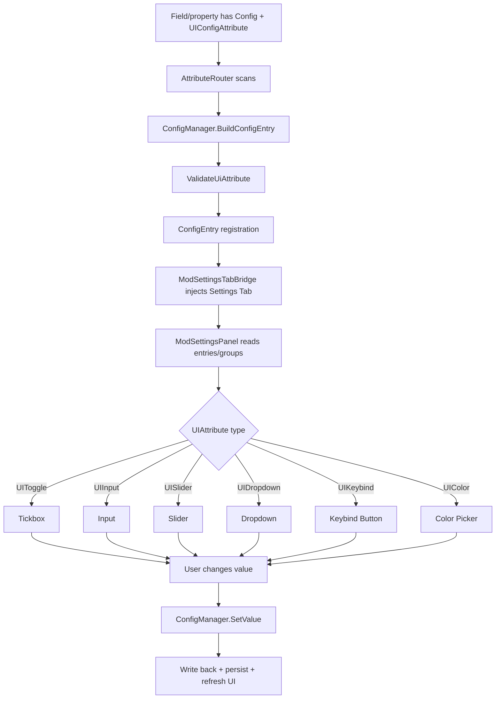

### 6.2 `UIButtonAttribute`

Constructor:

```csharp
[UIButton(string description, string buttonText = "按钮", string group = ConfigAttribute.DefaultGroup)]
```

| Property | Default | Description |
|---|---:|---|
| `Description` | Constructor parameter | Row display name/description |
| `ButtonText` | `"按钮"` | Button text |
| `Group` | `DefaultGroup` | Group |
| `Key` | `null` | Storage key, inferred from method name when empty |
| `LocTable` | `null` | Localization table |
| `DisplayNameKey` | `null` | Display name key |
| `DescriptionKey` | `null` | Help text key |
| `ButtonTextKey` | `null` | Button text key |
| `GroupKey` | `null` | Group key |
| `Color` | `UIButtonColor.Default` | Button color |
| `Order` | `0` | Sort order |
| `HelpText` | `null` | Hover help text |
| `IsValidMethod` | Static | Requires static parameterless method; non-void return values warn |

### 6.3 UI Attribute Overview

| Attribute | Constructor / Default | Supported Types | Description |
|---|---|---|---|
| `UIConfigAttribute` | Abstract base class | Any | Base class for UI metadata |
| `UIConfigAttribute<TValue>` | Abstract generic base class | Exact `TValue` | Automatically validates value type |
| `UIToggleAttribute` | None | `bool` | Checkbox |
| `UIKeybindAttribute` | `(bool allowController = false, bool allowKeyboard = true)` | `Godot.Key` or `JmcKeyBinding` | Key binding; controller support requires `JmcKeyBinding`; use `JKB` unless there is a reason not to |
| `UIInputAttribute` | `(int characterLimit = 0, bool multiline = false)` | `string` | Text input |
| `UIColorAttribute` | `(params string[] presets)` | `Godot.Color` | Color selection; defaults to `Palette=Game`, `AllowCustom=true`, `AllowAlpha=true` |
| `UISliderAttribute` | `(double min, double max, double step = 1.0)` | Numeric types | General numeric slider |
| `UIIntSliderAttribute` | `(int min, int max, int characterLimit = 5)` | `int` | int slider |
| `UIDropdownAttribute` | `(params string[]? exclude)` | `string` or enum | strings are used as options; enum values are used as exclusions |
| `UIDropdownOptionsProviderAttribute` | `(string providerName, params string[] dependsOn)` | `string` or enum dropdowns | Provides runtime dropdown choices and declares dependencies that should refresh the list |
| `UIVisibleWhenAttribute` | `(string dependsOn)` / `(string dependsOn, bool/string/int/double expectedValue)` | Any config entry | Dynamically shows or hides the current config entry based on another config value in the same MOD |

Enums:

```csharp
public enum UIButtonColor { Default, Green, Red, Gold, Blue, Reset }
public enum UIColorPalette { None, Basic, Game, CardRarity, Rainbow }
public enum UIDropdownInvalidValuePolicy { KeepCurrent, SelectFirstAvailable, ResetToDefault }
```

Interface:

```csharp
public interface ISliderConfigAttribute
{
    double Min { get; }
    double Max { get; }
    double Step { get; }
}

public interface IConfigUiContext
{
    T Get<T>(string key);
    bool TryGet<T>(string key, out T value);
    object? Get(string key);
    bool TryGet(string key, out object? value);
}
```

Dynamic dropdown example:

```csharp
[UIDropdown("Offense", "Defense")]
[Config("Mode", Key = "dropdown.mode")]
public static string Mode = "Offense";

[UIDropdown]
[UIDropdownOptionsProvider(
    nameof(GetChoiceOptions),
    nameof(Mode),
    InvalidValuePolicy = UIDropdownInvalidValuePolicy.SelectFirstAvailable)]
[Config("Choice", Key = "dropdown.choice")]
public static string Choice = "Strike";

private static IReadOnlyList<string> GetChoiceOptions(IConfigUiContext ctx)
{
    return ctx.Get<string>(nameof(Mode)) == "Defense"
        ? ["Block", "Guard", "Barrier"]
        : ["Strike", "Bash", "Whirlwind"];
}
```

Dynamic visibility example:

```csharp
[UIToggle]
[Config("Show Advanced", Key = "advanced.enabled")]
public static bool AdvancedEnabled = false;

[UIInput(64)]
[UIVisibleWhen(nameof(AdvancedEnabled))]
[Config("Advanced Text", Key = "advanced.text")]
public static string AdvancedText = "Only visible when enabled";

[UIDropdown("Simple", "Advanced")]
[Config("Mode", Key = "advanced.mode")]
public static string Mode = "Simple";

[UIIntSlider(0, 100)]
[UIVisibleWhen(nameof(Mode), "Advanced")]
[Config("Advanced Power", Key = "advanced.power")]
public static int AdvancedPower = 50;
```

Hiding only affects the settings UI row. It does not unregister the config entry and does not automatically clear, reset, or stop persisting the value.

---

## 7. Hotkey / Input: Hotkeys and Input

### 7.1 Lifecycle Diagram

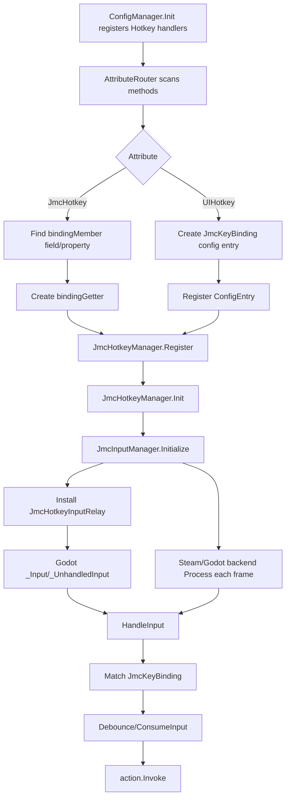

### 7.2 `JmcKeyModifiers`

Namespace: `JmcModLib.Config.UI`

```csharp
[Flags]
public enum JmcKeyModifiers
{
    None = 0,
    Ctrl = 1,
    Shift = 2,
    Alt = 4,
    Meta = 8
}
```

### 7.3 `JmcKeyBinding`

Namespace: `JmcModLib.Config.UI`

Constructors:

```csharp
new JmcKeyBinding()
new JmcKeyBinding(Key keyboard)
new JmcKeyBinding(Key keyboard = Key.None, string controller = "", JmcKeyModifiers modifiers = JmcKeyModifiers.None, bool enabled = true)
new JmcKeyBinding(Key keyboard, string controller, JmcKeyModifiers modifiers)
new JmcKeyBinding(Key keyboard, JmcKeyModifiers modifiers, bool enabled = true)
```

| Member | Description |
|---|---|
| `Keyboard` | Keyboard key; `Key.None` means there is no keyboard binding |
| `Controller` | Controller action name |
| `Modifiers` | Modifier key combination |
| `Enabled` | Whether enabled; the default struct is also treated as enabled |
| `HasKeyboard` | Whether it has a keyboard binding |
| `HasModifiers` | Whether it has modifier keys |
| `HasController` | Whether it has a controller action |
| `WithKeyboard(Key keyboard)` | Replaces the keyboard key and clears modifiers |
| `WithKeyboard(Key keyboard, JmcKeyModifiers modifiers)` | Replaces the keyboard key and modifiers |
| `WithController(string? controller)` | Replaces the controller action |
| `WithEnabled(bool enabled)` | Changes enabled state |
| `IsPressed(InputEvent inputEvent, bool allowEcho = false, bool exactModifiers = true)` | Checks whether the input event triggers the binding |
| `IsReleased(InputEvent inputEvent)` | Checks for release |
| `IsDown(bool exactModifiers = true)` | Whether it is currently down |
| `implicit operator JmcKeyBinding(Key keyboard)` | Implicitly creates from `Key` |
| `static IsPressed(Key keyboard, InputEvent inputEvent, bool allowEcho = false)` | Static convenience method |
| `static IsReleased(Key keyboard, InputEvent inputEvent)` | Static convenience method |
| `ToKeyboardText()` | Human-readable keyboard binding text |
| `ToString()` | Keyboard/controller combined text |
| `ReadModifiers(InputEventKey keyEvent)` | Reads modifiers from an event |
| `ReadCurrentModifiers()` | Reads currently pressed modifiers |
| `IsModifierKey(Key key)` | Whether the key is a modifier key |
| `ReadKey(InputEventKey keyEvent)` | Reads the actual keycode |

### 7.4 `JmcHotkeyAttribute`

```csharp
[JmcHotkey(string bindingMember)]
```

| Property | Default | Description |
|---|---:|---|
| `BindingMember` | Constructor parameter | Static field/property name that stores `Key` or `JmcKeyBinding` |
| `Key` | `null` | Hotkey registration key; inferred from method name when empty |
| `ConsumeInput` | `true` | Consumes input after triggering |
| `ExactModifiers` | `true` | Whether to disallow extra modifiers; `true` means modifiers must match exactly, while `false` only requires the configured modifiers to be included |
| `AllowEcho` | `false` | Whether repeated echo input from holding a keyboard key can trigger again |
| `DebounceMs` | `150` | Debounce in milliseconds |

Methods must be static and parameterless; return values are ignored.

### 7.5 `UIHotkeyAttribute`

```csharp
[UIHotkey(string displayName, string group = ConfigAttribute.DefaultGroup)]
```

| Property | Default | Description |
|---|---:|---|
| `DisplayName` | Constructor parameter | Display name in the settings UI |
| `Group` | `DefaultGroup` | Group |
| `Key` | `null` | Base config key / hotkey key |
| `Description` | `null` | Description |
| `LocTable` | `null` | Localization table |
| `DisplayNameKey` | `null` | Display name key |
| `DescriptionKey` | `null` | Description key |
| `GroupKey` | `null` | Group key |
| `Order` | `0` | Sort order |
| `RestartRequired` | `false` | Whether to indicate a restart is required |
| `DefaultKeyboard` | `Key.None` | Default keyboard key |
| `DefaultModifiers` | `None` | Default modifiers |
| `DefaultController` | `""` | Default controller action |
| `AllowKeyboard` | `true` | Allows keyboard binding |
| `AllowController` | `false` | Allows controller binding |
| `ConsumeInput` | `true` | Consumes input after triggering |
| `ExactModifiers` | `true` | Whether to disallow extra modifiers; `true` means modifiers must match exactly, while `false` only requires the configured modifiers to be included |
| `AllowEcho` | `false` | Whether repeated echo input from holding a keyboard key can trigger again |
| `DebounceMs` | `150` | Debounce |

### 7.6 `JmcHotkeyManager`

| Member | Description |
|---|---|
| `IsInitialized` | Whether the hotkey system is initialized |
| `Init()` | Initializes the input backend and unregister events |
| `Register(string key, Func<JmcKeyBinding> bindingGetter, Action action, bool consumeInput = true, bool exactModifiers = true, bool allowEcho = false, ulong debounceMs = 150, Assembly? assembly = null)` | Registers a dynamically bound hotkey |
| `Register(string key, Func<Key> keyGetter, Action action, bool consumeInput = true, bool exactModifiers = true, bool allowEcho = false, ulong debounceMs = 150, Assembly? assembly = null)` | Registers a keyboard hotkey |
| `Unregister(string key, Assembly? assembly = null)` | Unregisters a single hotkey |
| `UnregisterAssembly(Assembly? assembly = null)` | Unregisters all hotkeys under an Assembly |

### 7.7 `HotkeyOptions`

```csharp
public readonly record struct HotkeyOptions(
    bool ConsumeInput = true,
    bool ExactModifiers = true,
    bool AllowEcho = false,
    ulong DebounceMs = 150);
```

---

## 8. Steam Input Integration

### 8.1 Lifecycle Diagram

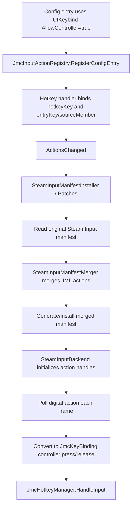

Most Steam Input-related types are internal. The public API is exposed indirectly mainly through `UIKeybind(allowController: true)`, `JmcKeyBinding.Controller`, and `UIHotkey.AllowController`. Child MODs should not depend directly on the internal installer/merger.

---

## 9. Logger: Logging

### 9.1 Lifecycle Diagram

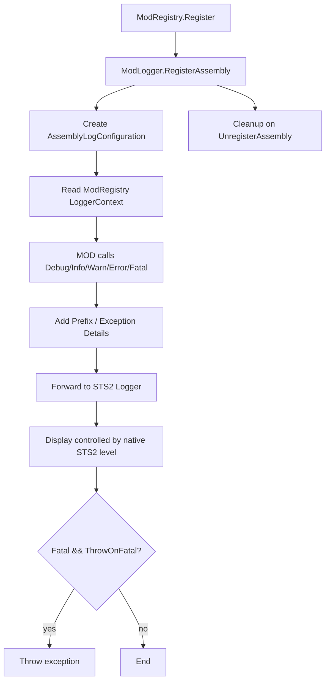

JML does not maintain a minimum display level. To adjust log display, use native STS2 developer console commands, such as `log Debug` or `log Generic Debug`.

### 9.2 Types and Members

Namespace: `JmcModLib.Utils`

```csharp
[Flags]
public enum LogPrefixFlags
{
    None = 0,
    Timestamp = 1,
    Default = Timestamp
}
```

`AssemblyLogConfiguration`:

| Property | Default |
|---|---:|
| `LogType` | `LogType.Generic` |
| `PrefixFlags` | `LogPrefixFlags.Default` |
| `ThrowOnFatal` | `true` |
| `IncludeExceptionDetails` | `true` |

`LoggerSnapshot`:

```csharp
public readonly record struct LoggerSnapshot(
    LogType LogType,
    LogPrefixFlags PrefixFlags,
    bool ThrowOnFatal,
    bool IncludeExceptionDetails,
    string Context);
```

`ModLogger`:

| Member | Description |
|---|---|
| `DefaultLogType` | Default Generic |
| `DefaultPrefixFlags` | Default Timestamp |
| `DefaultThrowOnFatal` | Default true |
| `DefaultIncludeExceptionDetails` | Default true |
| `RegisterAssembly(Assembly? assembly = null, LogPrefixFlags prefixFlags = LogPrefixFlags.Default, bool throwOnFatal = true, LogType logType = LogType.Generic, bool includeExceptionDetails = true)` | Registers Assembly log configuration |
| `UnregisterAssembly(Assembly? assembly = null)` | Clears log configuration |
| `GetLogType/SetLogType` | Reads/sets STS2 log type |
| `GetPrefixFlags/SetPrefixFlags` | Reads/sets prefix |
| `HasPrefixFlag/TogglePrefixFlag` | Checks/toggles a prefix flag |
| `GetSnapshot` | Gets the current configuration snapshot |
| `Load/Trace/Debug/Info/Warn/Error/Fatal` | Log output methods |
| `Warn(string message, Exception exception, Assembly? assembly = null)` | warn with exception |
| `Error(string message, Exception exception, Assembly? assembly = null)` | error with exception |
| `Fatal(Exception exception, string? message = null, Assembly? assembly = null)` | fatal, may throw |

---

## 10. L10n: Localization

### 10.1 Lifecycle Diagram

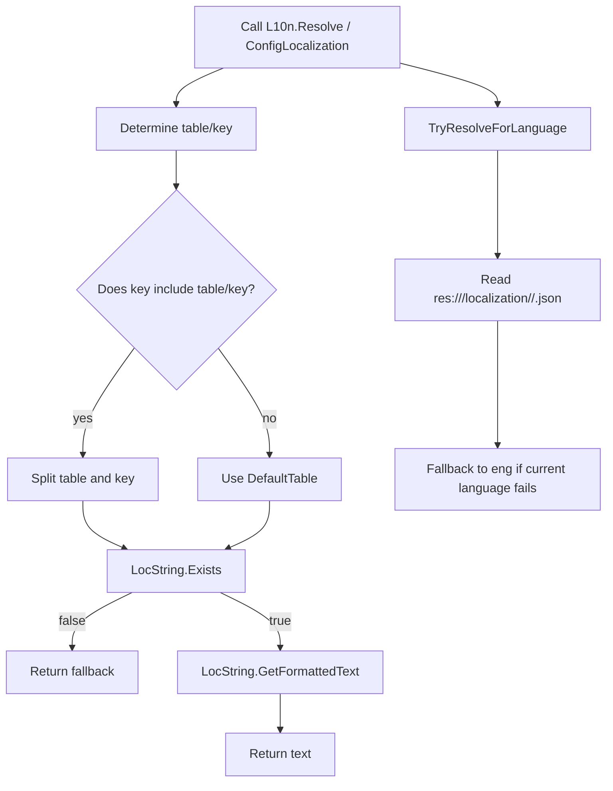

### 10.2 `L10n`

Namespace: `JmcModLib.Utils`

| Member | Description |
|---|---|
| `FallbackLanguage = "eng"` | Fallback language |
| `DefaultTable = "settings_ui"` | Default table |
| `SupportedLanguages` | STS2 supported language list |
| `CurrentLanguage` | Current language; falls back to `eng` on failure |
| `GetModLocalizationRoot(Assembly? assembly = null)` | `res://<pck>/localization` |
| `GetModLocalizationDirectory(string? language = null, Assembly? assembly = null)` | Directory for the specified language |
| `GetModTablePath(string fileName, string? language = null, Assembly? assembly = null)` | Table file path, automatically appending `.json` |
| `HasModTable(string fileName, string? language = null, Assembly? assembly = null)` | Whether the resource exists |
| `EnumerateExistingModTablePaths(string fileName, Assembly? assembly = null)` | Current-language and fallback paths |
| `Create(string table, string key, Action<LocString>? configure = null)` | Creates a `LocString` |
| `CreateIfExists(string table, string key, Action<LocString>? configure = null)` | Creates one only if it exists |
| `Exists(string table, string key)` | Whether the key exists |
| `TryGetFormattedText(string table, string key, out string? text, Action<LocString>? configure = null, Assembly? assembly = null)` | Tries to format |
| `Resolve(string? key, string? fallback = null, string? table = null, Assembly? assembly = null, Action<LocString>? configure = null)` | Resolves text; returns fallback/empty string on failure |
| `ResolveAny(IEnumerable<string?> keys, string? fallback = null, string? table = null, Assembly? assembly = null, Action<LocString>? configure = null)` | Multi-key fallback |
| `ResolvePath(string? path, string? fallback = null, Assembly? assembly = null, Action<LocString>? configure = null)` | Resolves using the default table |
| `TryResolve(string? key, out string text, string? table = null, Assembly? assembly = null, Action<LocString>? configure = null)` | Tries to resolve |
| `GetFormattedText(string table, string key, Action<LocString>? configure = null)` | Direct formatting |
| `GetRawText(string table, string key)` | Raw text |
| `SubscribeToLocaleChange(LocManager.LocaleChangeCallback callback)` | Subscribes to locale changes |
| `UnsubscribeToLocaleChange(LocManager.LocaleChangeCallback callback)` | Unsubscribes from locale changes |

---

## 11. Reflection: Reflection Accessors

### 11.1 Lifecycle Diagram

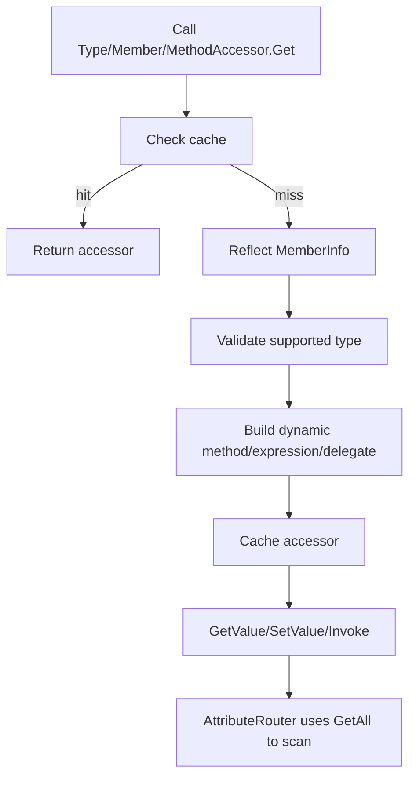

### 11.2 `ReflectionAccessorBase`

Namespace: `JmcModLib.Reflection`

| Member | Description |
|---|---|
| `DefaultFlags` | `Instance | Static | Public | NonPublic` |
| `Name` | Member name |
| `DeclaringType` | Declaring type |
| `IsStatic` | Whether static |
| `IsSaveOwner(Type? declaringType)` | Determines whether the type is suitable as an owner |
| `GetAttribute<T>()` | Gets a single Attribute |
| `HasAttribute<T>()` | Whether it has an Attribute |
| `GetAttributes(Type? type = null)` | Gets Attributes |
| `GetAllAttributes()` | Gets all Attributes |

Generic base class `ReflectionAccessorBase<TMemberInfo,TAccessor>`:

| Member | Description |
|---|---|
| `CacheCount` | Cache count |
| `ClearCache()` | Clears cache |
| `MemberInfo` | Original `MemberInfo` |

### 11.3 `TypeAccessor`

| Member | Description |
|---|---|
| `Type` | Original `Type` |
| `new TypeAccessor(Type type)` | Constructs and detects static classes |
| `Get(Type type)` | Gets from cache |
| `Get<T>()` | Generic get |
| `GetAll(Assembly asm)` | Gets all safe types in an Assembly |
| `CreateInstance()` | Creates an instance with a parameterless constructor; returns null and logs on failure |
| `CreateInstance(params object?[] args)` | Constructor with arguments |
| `CreateInstance<T>() where T : class` | Generic create |

### 11.4 `MemberAccessor`

| Member | Description |
|---|---|
| `CanRead` / `CanWrite` | Whether readable/writable |
| `ValueType` | Field/property type |
| `MemberType` | Field/Property |
| `TypedGetter` / `TypedSetter` | Strongly typed delegates; may be null for indexers/ref-like cases |
| `GetValue(object? target)` | Reads a non-indexed member |
| `SetValue(object? target, object? value)` | Writes a non-indexed member |
| `GetValue(object? target, params object?[] indexArgs)` | Reads an indexer |
| `SetValue(object? target, object? value, params object?[] indexArgs)` | Writes an indexer |
| `GetValue<TTarget,TValue>(TTarget target)` | Generic instance read |
| `SetValue<TTarget,TValue>(TTarget target, TValue value)` | Generic instance write |
| `GetValue<TValue>()` | Static read |
| `SetValue<TValue>(TValue value)` | Static write |
| `Get(Type type, string memberName)` | Finds a field/property by name |
| `GetIndexer(Type type, params Type[] parameterTypes)` | Finds an indexer by index parameter types |
| `Get(MemberInfo member)` | Gets by MemberInfo |
| `GetAll(Type type, BindingFlags flags = DefaultFlags)` | Gets all fields/properties |
| `GetAll<T>(BindingFlags flags = DefaultFlags)` | Generic get-all |

### 11.5 `MethodAccessor`

| Member | Description |
|---|---|
| `IsStatic` | Whether static |
| `TypedDelegate` | Strongly typed delegate; may be null for some complex methods |
| `Get(MethodInfo method)` | Gets an accessor |
| `GetTypedDelegate(MethodInfo method)` | Gets a strongly typed delegate |
| `GetAll(Type type, BindingFlags flags = DefaultFlags)` | Gets all methods |
| `GetAll<T>(BindingFlags flags = DefaultFlags)` | Generic get-all methods |
| `Get(Type type, string methodName, Type[]? parameterTypes = null)` | Finds a method by name/parameters |
| `MakeGeneric(params Type[] genericTypes)` | Constructs a generic method accessor |
| `Invoke(object? instance, params object?[] args)` | General invocation |
| `Invoke(object? instance)` / `Invoke(instance, a0/a1/a2)` | 0-3 argument convenience invocation |
| `Invoke<TTarget,TResult>(TTarget instance)` | Generic instance invocation |
| `Invoke<TTarget,T1,TResult>(...)` | 1-argument generic instance invocation |
| `Invoke<TTarget,T1,T2,TResult>(...)` | 2-argument generic instance invocation |
| `Invoke<TTarget,T1,T2,T3,TResult>(...)` | 3-argument generic instance invocation |
| `InvokeVoid<TTarget>(...)` | void instance invocation |
| `InvokeVoid<TTarget,T1/T2/T3>(...)` | 1-3 argument void instance invocation |
| `InvokeStatic<TResult>()` | Static return-value invocation |
| `InvokeStatic<T1,TResult>(...)` | 1-argument static return-value invocation |
| `InvokeStatic<T1,T2,TResult>(...)` | 2-argument static return-value invocation |
| `InvokeStatic<T1,T2,T3,TResult>(...)` | 3-argument static return-value invocation |
| `InvokeStaticVoid()` | Static void invocation |
| `InvokeStaticVoid<T1/T2/T3>(...)` | 1-3 argument static void invocation |

### 11.6 `ExprHelper`

Namespace: `JmcModLib.Utils`. The source file is `Utils/ExprHelper.cs`; functionally, it still belongs to reflection access helpers.

| Member | Description |
|---|---|
| `EnableCache` | Whether cache is enabled; default true |
| `AccessMode` | Accessor generation mode; default `MemberAccessMode.Default` |
| `MemberAccessMode` | `Reflection` / `ExpressionTree` / `Emit` / `Default=Emit` |
| `MemberAccessors(Delegate Getter, Delegate Setter)` | Accessor record |
| `GetOrCreateAccessors<T>(Expression<Func<T>> expr, Assembly? assembly = null)` | Gets getter/setter from an expression |
| `GetOrCreateAccessors<T>(Expression<Func<T>> expr, out bool cacheHit, Assembly? assembly = null)` | Includes cache-hit output |
| `ClearAssemblyCache(Assembly? assembly = null)` | Clears cache for the specified Assembly |

### 11.7 `GameRestart`

Namespace: `JmcModLib.Utils`. The source file is `Utils/GameRestart.cs`.

`GameRestart` requests a game restart. On desktop platforms it uses Godot `OS.SetRestartOnExit` to schedule relaunch after exit, then calls the game's native `NGame.Quit()` so settings, progress, and profile saves still run. On platforms where Godot does not support automatic restart, such as Android and iOS, it returns `false`; callers should tell the user to restart manually.

| Member | Description |
|---|---|
| `IsRestartSupported` | Whether the current platform supports automatic restart through JML |
| `TryScheduleRestart(bool preserveCommandLineArguments = true, Assembly? assembly = null)` | Schedules restart on the next normal exit without quitting |
| `RequestRestart(bool preserveCommandLineArguments = true, Assembly? assembly = null)` | Schedules restart and requests the native quit flow |
| `ShowRestartConfirmationAsync(bool preserveCommandLineArguments = true, Assembly? assembly = null)` | Shows the JML confirmation popup; requests restart after confirmation |

```csharp
using JmcModLib.Utils;

bool requested = await GameRestart.ShowRestartConfirmationAsync(
    assembly: typeof(MainFile).Assembly);
```

---

## 12. Prefabs: Popups

### 12.1 Lifecycle Diagram

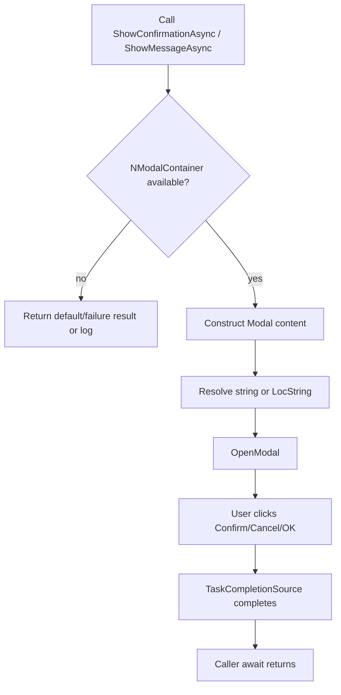

### 12.2 `JmcConfirmationPopup`

Namespace: `JmcModLib.Prefabs`. Source files are under `Prefabs/`.

| Member | Description |
|---|---|
| `IsAvailable` | Whether a modal can currently be shown |
| `ShowConfirmationAsync(string title, string body, string? confirmText = null, string? cancelText = null, bool showBackstop = true, Assembly? assembly = null)` | Confirm/cancel popup, returns bool |
| `ShowMessageAsync(string title, string body, string? okText = null, bool showBackstop = true, Assembly? assembly = null)` | OK message popup |
| `LocString` overloads | Supports localized string parameters |

### 12.3 `JmcSecretInputPopup`

Namespace: `JmcModLib.Prefabs`. Source files are under `Prefabs/`.

`JmcSecretInputPopup` is for entering Secret plaintext. It uses `LineEdit.Secret = true`, does not prefill the old value, and never logs the input. Ordinary child MODs usually do not call it directly; after `[Secret]` or `RegisterSecret` registration, the JML settings page uses it automatically.

| Member | Description |
|---|---|
| `IsAvailable` | Whether a modal can currently be shown |
| `PromptAsync(JmcSecretInputPopupOptions options, Assembly? assembly = null)` | Opens a Secret input popup; confirm returns the input, while cancel/close/unavailable returns `null` |
| `JmcSecretInputPopupOptions.Title` | Required popup title |
| `Description` | Optional description or risk warning |
| `Placeholder` | Input placeholder text |
| `ConfirmText` / `CancelText` | Button text |
| `EmptyText` | Prompt shown when the input is empty |
| `ProtectionLevel` | Current Secret protection level, available for caller-composed risk text |
| `ShowBackstop` | Whether to show the native dark modal backstop |
| `MinimumSize` | Popup minimum size |

### 12.4 `JmcReportPopup`

Namespace: `JmcModLib.Prefabs`. Source files are under `Prefabs/`.

`JmcReportPopup` displays longer diagnostic reports, log summaries, or debug information. It opens through the game's `NModalContainer`; the body uses a clipped `ScrollContainer` containing the game's `MegaRichTextLabel`, making it suitable for long logs and diagnostic reports. The body can be rendered as plain text, game rich text, or lightweight Markdown.

The lightweight Markdown renderer escapes body text before converting it to game rich text, then renders headings, bold, italics, lists, blockquotes, horizontal rules, inline code, code fences, and plain links. Blockquotes are shown as muted, indented text with a vertical rail on the left. Log lines in normal paragraphs and code fences automatically detect prefixes such as `[WARN]`/`WARNING:` and `[ERROR]`/`ERROR:`, using warning yellow and error red colors close to LogConsole.

| Member | Description |
|---|---|
| `IsAvailable` | Whether a modal can currently be shown |
| `Open(JmcReportPopupOptions options, Assembly? assembly = null)` | Opens a report popup and returns `JmcReportPopupHandle` on success |
| `JmcReportPopupOptions.Title` | Required popup title |
| `JmcReportPopupOptions.Body` | Body text, rendered as plain text by default |
| `JmcReportPopupOptions.Subtitle` | Optional subtitle |
| `JmcReportPopupOptions.Status` | Optional footer status text |
| `JmcReportPopupOptions.BodyFormat` | Body parser: `PlainText`, `RichText`, or `Markdown` |
| `JmcReportPopupOptions.BodyUsesRichText` | Legacy compatibility option; new code should prefer `BodyFormat` |
| `JmcReportPopupOptions.Buttons` | Footer buttons; an empty list adds a default close button |
| `JmcReportPopupOptions.ShowBackstop` | Whether to show the native dark modal backstop |
| `JmcReportPopupOptions.CloseOnEscape` | Whether Escape can close the popup |
| `JmcReportPopupOptions.MinimumSize` | Popup minimum size |
| `JmcReportPopupBodyFormat` | Body format enum |
| `JmcReportPopupButton` | Defines button key, text, callback, close-on-click, and initial enabled state |
| `JmcReportPopupHandle` | Updates title, subtitle, status, body and body format, button enabled state, or closes the popup |

Example:

```csharp
JmcReportPopupHandle? popup = JmcReportPopup.Open(new JmcReportPopupOptions
{
    Title = "SpireDoctor Diagnosis",
    Subtitle = "Latest 3 logs",
    Body = reportText,
    BodyFormat = JmcReportPopupBodyFormat.Markdown,
    Status = "Analysis complete",
    Buttons =
    [
        new JmcReportPopupButton("copy", "Copy", _ => DisplayServer.ClipboardSet(reportText)),
        new JmcReportPopupButton("close", "Close", closeOnClick: true)
    ]
});

popup?.SetStatus("Copied to clipboard");
```

---

## 13. UI: Pause Menu Button Extension

Namespace: `JmcModLib.UI.PauseMenu`

The pause menu button extension adds ordinary buttons to the in-run pause menu opened from the top-right pause button. It is not a config entry and does not persist values. If the same action should also have a hotkey, register a separate `JmcHotkey` or `UIHotkey` and call the same business method from both entry points.

### 13.1 Lifecycle Diagram

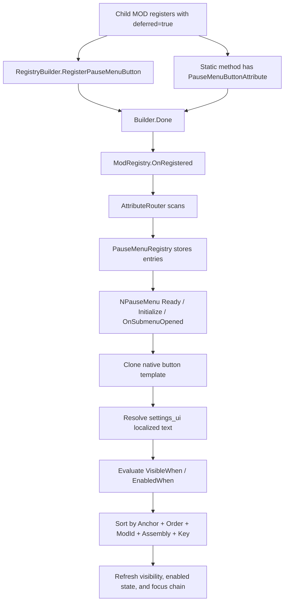

### 13.2 Attribute Usage

```csharp
using JmcModLib.UI.PauseMenu;
using JmcModLib.Utils;

[PauseMenuButton(
    "Debug Panel",
    Key = "open.debug.panel",
    LocTable = "settings_ui",
    TextKey = "EXTENSION.JMCMODLIB.PAUSE_MENU.MyMod.open_debug_panel.TEXT",
    Anchor = PauseMenuButtonAnchor.BeforeExitActions,
    Order = 10)]
internal static void OpenDebugPanel(PauseMenuButtonContext context)
{
    ModLogger.Info($"Opening debug panel from the pause menu, run in progress={context.IsRunInProgress}");
}
```

The Attribute entry point is for static methods and supports these signatures:

| Signature | Description |
|---|---|
| `static void Method()` | Synchronous action that does not need context |
| `static void Method(PauseMenuButtonContext context)` | Synchronous action that reads the current pause menu state |
| `static Task Method()` | Async action that does not need context |
| `static Task Method(PauseMenuButtonContext context)` | Async action that reads the current pause menu state |

### 13.3 Manual Registration Usage

```csharp
ModRegistry.Register<MainFile>(true)?
    .RegisterPauseMenuButton(
        key: "open.debug.panel",
        text: "Debug Panel",
        action: OpenDebugPanel,
        anchor: PauseMenuButtonAnchor.BeforeExitActions,
        order: 10,
        locTable: "settings_ui",
        textKey: "EXTENSION.JMCMODLIB.PAUSE_MENU.MyMod.open_debug_panel.TEXT",
        enabledWhen: static context => context.IsRunInProgress && !context.IsGameOver)
    .Done();

static void OpenDebugPanel(PauseMenuButtonContext context)
{
    ModLogger.Info($"Manual pause menu button clicked, run state={context.RunState?.GetType().Name}");
}
```

Manual registration is useful for dynamic conditions, cross-file composition, or explicit registration chains. Production MODs should pass both `key` and `textKey` explicitly so later method-name or fallback-text changes do not shift localization or unregister semantics.

### 13.4 `PauseMenuButtonAttribute`

| Property | Default | Description |
|---|---:|---|
| `Text` | Constructor parameter | Fallback button text |
| `Key` | `null` | Stable key; inferred from the declaring method when omitted |
| `Order` | `0` | Sort order within the same anchor; smaller values come first |
| `Anchor` | `BeforeExitActions` | Insertion anchor |
| `LocTable` | `"settings_ui"` | Text localization table |
| `TextKey` | `null` | Explicit button text key |
| `CloseMenuOnClick` | `false` | Whether to close the pause menu after click |
| `Color` | `UIButtonColor.Default` | Reuses settings-button color semantics or an equivalent abstraction |

### 13.5 `PauseMenuButtonOptions`

Metadata shared by manual registration and the lower-level registry.

| Property | Default | Description |
|---|---:|---|
| `Key` | Required | Stable key unique within the Assembly, used for node naming, localization convention keys, and unregistering |
| `Text` | Required | Fallback display text |
| `Order` | `0` | Sort order within the same anchor |
| `Anchor` | `BeforeExitActions` | Insertion anchor |
| `LocTable` | `"settings_ui"` | Localization table |
| `TextKey` | `null` | Explicit button text key |
| `VisibleWhen` | `null` | Runtime visibility predicate; exceptions hide the entry |
| `EnabledWhen` | `null` | Runtime enabled-state predicate; exceptions disable the entry |
| `CloseMenuOnClick` | `false` | Whether to close the pause menu after the callback is triggered successfully |
| `Color` | `UIButtonColor.Default` | Button color style |

### 13.6 `PauseMenuButtonAnchor`

| Value | Description |
|---|---|
| `AfterResume` | Insert after the Resume button |
| `AfterSettings` | Insert after the Settings button |
| `AfterCompendium` | Insert after the Compendium button |
| `BeforeExitActions` | Insert before Give Up, Disconnect, and Save and Quit; recommended default |
| `End` | Insert at the end of the pause menu |

Sorting is fixed as `Anchor`, `Order`, `ModId`, `AssemblyName`, `Key`. The same `Key` may coexist across different MODs; within one Assembly, a later registration with the same `Key` replaces the earlier one and logs a warning.

### 13.7 `PauseMenuButtonContext`

| Property | Type | Description |
|---|---|---|
| `Mod` | `ModContext` | Owning MOD context |
| `Assembly` | `Assembly` | Owning Assembly |
| `RunState` | `IRunState?` | Current run state, possibly null |
| `Menu` | `NPauseMenu` | Native pause menu node; ordinary MODs should avoid arbitrary mutation |
| `Button` | `NButton` | Current JML button node; ordinary MODs should avoid arbitrary mutation |
| `IsMultiplayerClient` | `bool` | Whether the current run is a multiplayer client |
| `IsRunInProgress` | `bool` | Whether a run is in progress |
| `IsGameOver` | `bool` | Whether the run is already over |

### 13.8 `PauseMenuRegistry`

| Member | Description |
|---|---|
| `RegisterButton(...)` | Manually registers a pause menu button, using `(Assembly, Key)` as identity |
| `UnregisterButton(string key, Assembly? assembly = null)` | Unregisters a button under the specified Assembly |
| `GetEntries(Assembly? assembly = null)` | Gets a snapshot of registered entries for the specified Assembly |

`PauseMenuRegistry` should clean up entries for an Assembly when `ModRegistry.OnUnregistered` fires. When refreshing the pause menu, JML should only move or update nodes it created and preserve unknown nodes for compatibility with other MODs.

### 13.9 Localization Convention

Button text defaults to the `settings_ui` table. Prefer explicit `TextKey`, for example:

```json
{
  "EXTENSION.JMCMODLIB.PAUSE_MENU.MyMod.open_debug_panel.TEXT": "Debug Panel"
}
```

If `TextKey` is omitted, the implementation may infer a convention key from `ModId + Key`; the docs and Demo use explicit keys to make multi-language files and later renames easier to maintain.

---

## 14. Build / Deploy and Child MOD Props

### 14.1 Lifecycle Diagram

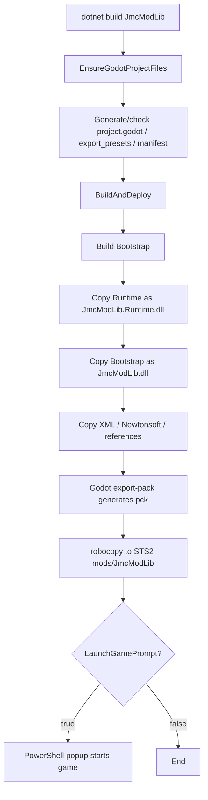

### 14.2 Current MSBuild Key Points

JML main project:

- `TargetFramework=net9.0`
- `GenerateDocumentationFile=true`
- The default local paths are Windows personal paths and should preferably be localized into user props.
- `BuildAndDeploy` builds both Bootstrap and Runtime.
- Runtime is copied as `JmcModLib.Runtime.dll`; Bootstrap is copied as `JmcModLib.dll`.

Child MOD props:

```xml
<Project>
  <PropertyGroup>
    <JmcModLibPublishDir Condition="'$(JmcModLibPublishDir)' == ''">$(MSBuildThisFileDirectory)</JmcModLibPublishDir>
    <JmcModLibRoot Condition="'$(JmcModLibRoot)' == ''">$(JmcModLibPublishDir)</JmcModLibRoot>
    <JmcModLibRuntimePath Condition="'$(JmcModLibRuntimePath)' == ''">$(JmcModLibPublishDir)JmcModLib.Runtime.dll</JmcModLibRuntimePath>
  </PropertyGroup>

  <ItemGroup>
    <Reference Include="JmcModLib">
      <HintPath>$(JmcModLibRuntimePath)</HintPath>
      <Private>false</Private>
    </Reference>
  </ItemGroup>
</Project>
```

---

## 15. Default Parameter Semantics Index

| Default Parameter | API | Semantics | Documentation Guidance |
|---|---|---|---|
| `assembly = null` | Most APIs | Resolves the caller Assembly through the call stack | Can be omitted at entry points; pass explicitly in helpers |
| `displayName/version = null` | `ModRegistry.Register` | Falls back from manifest / Assembly | Omit for ordinary MODs |
| `deferredCompletion = bool` | `Register<T>(bool)` | true returns builder, false immediately calls Done | Prefer adding semantic overloads |
| `group = DefaultGroup` | Config/UI/Button | Default group | UI layer should preferably localize it as a regular group |
| `storageKey = null` | Manual config/button | Derived from display text | Production MODs should not omit it |
| `Key = null` | Attribute config/button/hotkey | Inferred from type/member/method | Prefer explicit stable keys after release |
| `buttonText = "按钮"` | Button | Button fallback text | Prefer localization or a neutral English default |
| `FlushOnSet = true` | ConfigManager | Writes to disk on every SetValue | Consider debounce for high-frequency sliders |
| `allowKeyboard = true` | UIKeybind/UIHotkey | Keyboard binding enabled by default | Reasonable |
| `allowController = false` | UIKeybind/UIHotkey | Controller binding disabled by default | Reasonable |
| `ConsumeInput = true` | Hotkey | Consumes input after triggering | Reasonable for action hotkeys; set false for debug hotkeys |
| `ExactModifiers = true` | Hotkey | Disallows extra modifiers | Avoids `Ctrl + F8` accidentally triggering `F8` |
| `AllowEcho = false` | Hotkey | Does not react to repeated hold input | Reasonable for ordinary action hotkeys; repeated actions may set true |
| `DebounceMs = 150` | Hotkey | 150ms debounce | Reasonable |
| `Anchor = BeforeExitActions` | PauseMenuButton | Inserts before exit/danger actions | Recommended default location for ordinary tool buttons |
| `CloseMenuOnClick = false` | PauseMenuButton | Does not close the pause menu by default after clicking | Avoids surprising navigation for tool buttons, popup buttons, and state toggles |
| `FallbackLanguage = eng` | L10n | English fallback | Reasonable |
| `DefaultTable = settings_ui` | L10n | Default settings table | Reasonable |

---

## 16. Inter-Module Dependency Overview

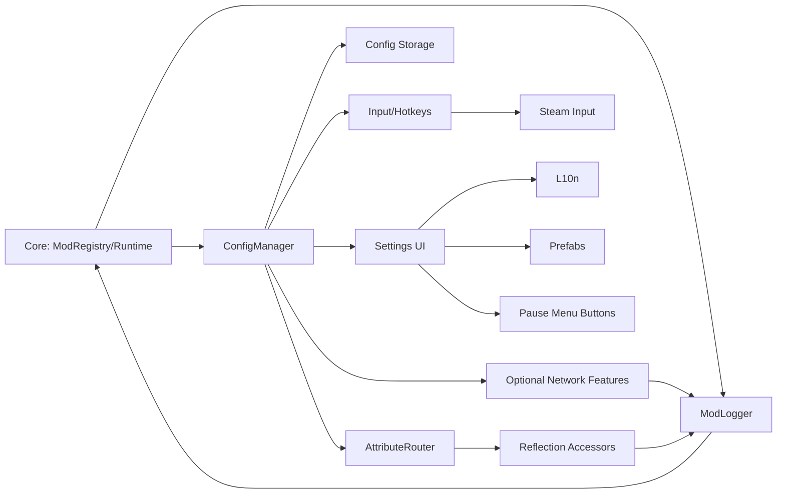

The most important architectural direction is to keep `Core` light, `Config` stable, and `Input/UI` replaceable. Game UI and Steam Input are both externally volatile areas, so hard-coded selectors and manifest merging logic should be isolated in internal layers.

---

## 17. Multiplayer: Optional Network Features

Namespace: `JmcModLib.Multiplayer`

This module binds a static bool config, its exclusive `INetMessage` marker, and runtime protocol state. The initial manifest uses `affects_gameplay=false`; JML promotes the owning MOD to gameplay-affecting and adds its compatibility identity only while the feature is actually enabled.

### 17.1 `OptionalNetworkFeatureAttribute`

The target must be a static `bool` field or property that also carries `[Config]`.

| Member | Description |
|---|---|
| `OptionalNetworkFeatureAttribute(string id, Type messageMarkerType)` | Declares a stable feature ID and exclusive message marker; the marker must be an interface inheriting `INetMessage` |
| `Id` | Stable feature identifier within the owning MOD |
| `MessageMarkerType` | Exclusive message marker for the feature |
| `CompatibilityVersion` | Protocol compatibility version, default `"1"`; increment after incompatible changes |

A concrete message cannot belong to two optional features. Every message owned by the feature must implement its marker.
Declarations must be scanned during normal MOD initialization. Registration after the game's base protocol has initialized is rejected and fails closed.

### 17.2 `OptionalNetworkFeatureHandle`

| Member | Description |
|---|---|
| `Id` | Feature ID |
| `ModId` | Owning MOD ID |
| `CompatibilityVersion` | Current compatibility version |
| `RequestedEnabled` | State requested by the user's config, possibly not yet applied |
| `EffectiveEnabled` | State actually used by the current message protocol; handlers, send paths, and business entry points must use this value |
| `ApplyState` | Current apply state |
| `HasPendingApply` | Whether the request or apply state is still incomplete |
| `StateChanged` | Raised when any public state changes |
| `EffectiveEnabledChanged` | Raised when effective enablement really changes; use it to register/unregister handlers and cancel unfinished work |

`OptionalNetworkFeatureApplyState` values:

| Value | Description |
|---|---|
| `Applied` | The request has been applied to the current runtime protocol |
| `PendingNetworkIdle` | The config is saved and waiting for host/join/session activity to fully disconnect |
| `RestartRequired` | Hot rebuild failed; the previous effective protocol remains active and restart is needed to apply the request |

### 17.3 `OptionalNetworkFeatures`

| Member | Description |
|---|---|
| `Get(string id, Assembly? assembly = null)` | Gets a handle from an Assembly; throws `KeyNotFoundException` when unregistered, invalid, or missing |
| `Get<TOwner>(string id)` | Gets a handle using `TOwner`'s Assembly |
| `TryGet(string id, out OptionalNetworkFeatureHandle? handle, Assembly? assembly = null)` | Attempts to get a handle |

Query the handle after `ModRegistry.Register` completes Attribute scanning. Business code must not use the config field directly to decide whether to register or send messages: `RequestedEnabled` and `EffectiveEnabled` intentionally differ while waiting for disconnect.

### 17.4 Apply Strategy

- While networking is idle, JML rebuilds the game's message table at a safe main-thread point and hot-applies the change.
- While host startup, join flow, lobby, or an in-run session remains active, JML keeps the old protocol and reports `PendingNetworkIdle`; it applies the latest request after full disconnect.
- If rebuilding fails, JML rolls back to the old protocol, reports `RestartRequired`, and reuses the confirmation and safe-exit flow from `GameRestart.ShowRestartConfirmationAsync`.
- Normal switching does not require `[Config(RestartRequired=true)]`.
- While enabled, the compatibility identity includes `ModId`, feature `Id`, and `CompatibilityVersion`; both peers must match.

See [Optional Network Features](JML_OptionalNetworkFeatures_en.md) for the full example, manifest constraints, and integration checklist.
