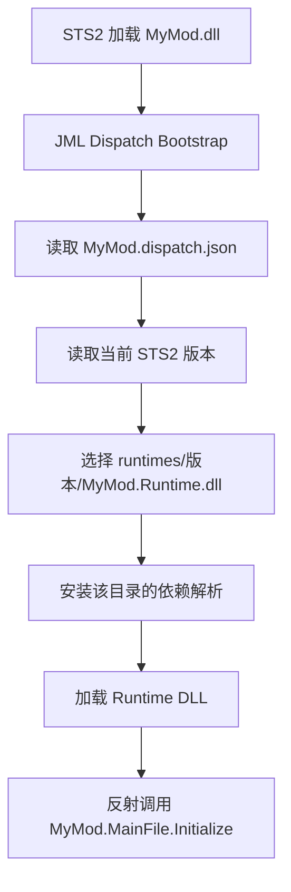

**🌐[ 中文 ]**

# JML Dispatch 多版本 DLL 分派

JML Dispatch 用于解决 STS2 早期版本频繁改动导致的 ABI 兼容问题：同一个 MOD 可以随包发布多份 Runtime DLL，游戏启动时由一个很薄的入口 DLL 根据当前游戏版本选择其中一份加载。

Dispatch 是 **零 JML 运行时依赖** 的工具链。也就是说，只使用 DLL 分派时，玩家不需要安装 JmcModLib；只有你的 Runtime 代码调用了 `ModRegistry`、`ModLogger`、配置 UI、热键等 JML API，才需要在 manifest 中依赖 JML。

---

## 1. 运行方式



`MyMod.dll` 是入口 Bootstrap，程序集名是 `MyMod`。真正的 MOD 代码应编译为另一个程序集名，例如 `MyMod.Runtime`。入口 DLL 和 Runtime DLL 不要使用相同的 AssemblyName。

---

## 2. 最小接入

在子 MOD 的 `.csproj` 中导入 JML 发布目录里的 targets：

```xml
<Import Project="$(ModDir)\JmcModLib\JmcModLib.Dispatch.targets" />
```

如果没有声明任何 `JmcDispatchRuntime`，JML 会生成默认单版本分派：

```text
modPublish/
  MyMod.dll
  MyMod.dispatch.json
  runtimes/
    default/
      MyMod.Runtime.dll
```

此时当前项目会默认编译为 `MyMod.Runtime.dll`，JML Dispatch 会额外生成同名入口 `MyMod.dll`。

---

## 3. 多版本声明

每个版本用哪份 DLL，推荐维护在 `.csproj` 中：

```xml
<PropertyGroup>
  <ModName>MyMod</ModName>
  <JmcDispatchInitializerType>MyMod.MainFile</JmcDispatchInitializerType>
  <JmcDispatchInitializerMethod>Initialize</JmcDispatchInitializerMethod>
</PropertyGroup>

<ItemGroup>
  <JmcDispatchRuntime Include="0.107">
    <MinGameVersion>0.107.0</MinGameVersion>
    <MaxGameVersionExclusive>0.108.0</MaxGameVersionExclusive>
    <RuntimeAssembly>runtimes/0.107/MyMod.Runtime.dll</RuntimeAssembly>
    <ProbeDirectories>runtimes/0.107</ProbeDirectories>
    <SourcePath>bin/Release/net9.0/sts2-0.107/MyMod.Runtime.dll</SourcePath>
  </JmcDispatchRuntime>

  <JmcDispatchRuntime Include="0.108">
    <MinGameVersion>0.108.0</MinGameVersion>
    <MaxGameVersionExclusive>0.109.0</MaxGameVersionExclusive>
    <RuntimeAssembly>runtimes/0.108/MyMod.Runtime.dll</RuntimeAssembly>
    <ProbeDirectories>runtimes/0.108</ProbeDirectories>
    <SourcePath>bin/Release/net9.0/sts2-0.108/MyMod.Runtime.dll</SourcePath>
  </JmcDispatchRuntime>
</ItemGroup>
```

`RuntimeAssembly` 和 `ProbeDirectories` 建议使用 `/`，避免 JSON 字符串中的 Windows 反斜杠转义问题。`ProbeDirectories` 和 `Dependencies` 可以用分号写多个值，Bootstrap 运行时会拆分。

构建后会生成：

```json
{
  "initializerType": "MyMod.MainFile",
  "initializerMethod": "Initialize",
  "entries": [
    {
      "id": "0.107",
      "minGameVersion": "0.107.0",
      "maxGameVersionExclusive": "0.108.0",
      "runtimeAssembly": "runtimes/0.107/MyMod.Runtime.dll",
      "probeDirectories": ["runtimes/0.107"],
      "dependencies": [""],
      "probeAllDlls": false
    }
  ]
}
```

运行时会按 `entries` 的顺序匹配。没有版本范围的条目会匹配所有版本，通常只用于最后的 fallback。

---

## 4. 常用 MSBuild 属性

| 属性 | 默认值 | 说明 |
|---|---|---|
| `JmcDispatchEnabled` | `true` | 是否启用 Dispatch 发布流程 |
| `JmcDispatchModName` | `$(ModName)` 或项目名 | 游戏 manifest 对应的 MOD ID，也是入口 DLL 名 |
| `JmcDispatchPublishDir` | `$(PublishDir)` 或 `$(ProjectDir)\$(ModName)\modPublish` | 发布目录 |
| `JmcDispatchRuntimeAssemblyName` | `$(JmcDispatchModName).Runtime` | 当前项目编译出的 Runtime AssemblyName |
| `JmcDispatchRuntimeFileName` | `$(JmcDispatchRuntimeAssemblyName).dll` | 默认 Runtime 文件名 |
| `JmcDispatchInitializerType` | `$(JmcDispatchModName).MainFile` | Runtime 初始化类型 |
| `JmcDispatchInitializerMethod` | `Initialize` | Runtime 初始化方法 |
| `JmcDispatchSetRuntimeAssemblyName` | `true` | 是否自动把当前项目 AssemblyName 改成 Runtime 名 |

如果你已经手动设置了 Runtime 项目的 `AssemblyName`，可以关闭自动改名：

```xml
<PropertyGroup>
  <JmcDispatchSetRuntimeAssemblyName>false</JmcDispatchSetRuntimeAssemblyName>
  <JmcDispatchRuntimeAssemblyName>MyCustomRuntimeName</JmcDispatchRuntimeAssemblyName>
</PropertyGroup>
```

---

## 5. `JmcDispatchRuntime` 元数据

| 元数据 | 说明 |
|---|---|
| `Include` | 分派项 ID，常用游戏小版本或 `default` |
| `MinGameVersion` | 最小 STS2 版本，闭区间 |
| `MaxGameVersionExclusive` | 最大 STS2 版本，开区间 |
| `RuntimeAssembly` | 发布目录下 Runtime DLL 的相对路径 |
| `ProbeDirectories` | 依赖探测目录，推荐只写当前 Runtime 目录 |
| `Dependencies` | 额外显式依赖 DLL，多个值用分号分隔 |
| `ProbeAllDlls` | 是否把探测目录下所有 DLL 都加入解析表 |
| `SourcePath` | 构建机上要复制到该分派目录的 Runtime DLL |
| `SourceDirectory` | 复制依赖时使用的源目录；默认从 `SourcePath` 推断 |

`SourcePath` 缺省为当前项目本次构建的 `$(TargetPath)`。单版本 MOD 通常不用设置；多版本 MOD 通常先用不同配置或脚本产出多份 Runtime，再在每个条目上设置对应 `SourcePath`。

---

## 6. Runtime 入口写法

只使用分派时，Runtime 可以是普通 STS2 MOD 代码，不需要引用 JML：

```csharp
using MegaCrit.Sts2.Core.Modding;

namespace MyMod;

public static class MainFile
{
    public static void Initialize()
    {
        // 正常初始化、Harmony patch 等。
    }
}
```

如果 Runtime 使用 JML 能力，则照常引用 `JmcModLib.Sts2.props` 并注册：

```csharp
using JmcModLib.Core;
using JmcModLib.Utils;

namespace MyMod;

public static class MainFile
{
    public static void Initialize()
    {
        ModRegistry.Register<MainFile>();
        ModLogger.Info("MyMod 已通过 JML Dispatch 加载。");
    }
}
```

此时 `MyMod.json` 需要声明 JML 依赖：

```json
"dependencies": [
  { "id": "JmcModLib", "min_version": "1.4.1" }
]
```

如果 Runtime 不使用 JML API，不要声明这个依赖。

---

## 7. 常见坑

| 现象 | 原因 | 处理 |
|---|---|---|
| 日志提示 Runtime 程序集标识已被入口 DLL 占用 | 入口 DLL 和 Runtime DLL 的 AssemblyName 相同 | 保持默认 `MyMod.Runtime`，或手动改成不同名称 |
| 找不到 `MyMod.dispatch.json` | targets 没导入，或发布目录不是游戏实际加载目录 | 检查 `JmcDispatchPublishDir` 和 `modPublish` |
| 没有匹配当前 STS2 版本的 Runtime | 版本范围没覆盖当前版本 | 增加条目或 fallback |
| 加载到了错误依赖 | 多个版本目录都被探测 | 每个条目的 `ProbeDirectories` 只写当前版本目录 |
| JSON 无效 | 在 `RuntimeAssembly` 或 `ProbeDirectories` 中使用了未转义反斜杠 | 使用 `/` |
| 只用分派却要求玩家安装 JML | manifest 里声明了 JML 依赖，或 Runtime 引用了 JML API | 不使用 JML API 时移除依赖 |

