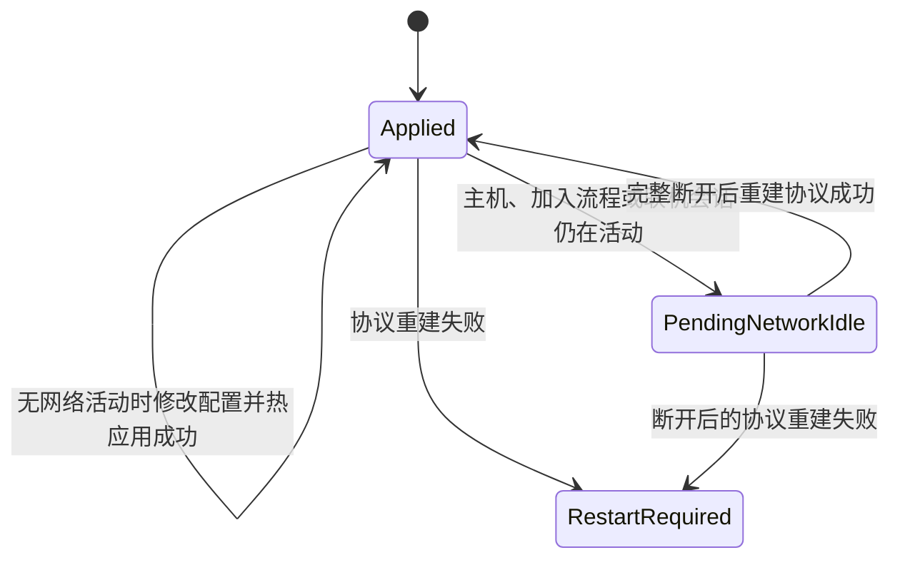

**🌐[ 中文 | [English](JML_OptionalNetworkFeatures_en.md) ]**

# JML 可选网络功能

可选网络功能用于这类 MOD：同一个程序集里既有完全本地的单人功能，也有一组只有用户主动开启时才参与多人协议的网络功能。关闭网络功能后，该 MOD 不会仅因这些消息类型而影响多人联机；开启后，JML 会让它进入游戏的玩法 MOD 兼容性校验。

这不是任意代码的热卸载机制。当前抽象只管理 `INetMessage` 消息集合、玩法 MOD 标记和对应的运行时协议状态。

---

## 1. 状态模型



配置字段表达用户想要的状态，句柄的 `EffectiveEnabled` 表达当前协议真正采用的状态。两者在等待断开或应用失败时可能不同，因此消息注册、消息发送和业务入口必须只看 `EffectiveEnabled`。

---

## 2. manifest 与适用边界

子 MOD 的初始 manifest 必须保持：

```json
{
  "id": "MyMod",
  "dependencies": [
    {
      "id": "JmcModLib",
      "min_version": "1.6.1"
    }
  ],
  "affects_gameplay": false
}
```

启用可选网络功能后，JML 会在当前运行时把所属 MOD 提升为影响玩法，并向游戏的玩法 MOD 列表加入由 `ModId`、功能 `Id` 和 `CompatibilityVersion` 构成的兼容性身份；关闭后则移除该功能的消息和身份。

如果 MOD 本身还有始终影响玩法的内容，manifest 应保持 `affects_gameplay=true`，并且不要在该 MOD 中声明这套 API；管理器会拒绝 manifest 初始标记为 `true` 的声明，因为它无法把整个 MOD 降级为不影响玩法。可选网络功能也不适合管理模型、存档结构或其它不能安全重建的全局注册。

---

## 3. 声明配置、标记接口和消息

每个功能需要一个独占的标记接口。标记接口必须继承 `INetMessage`，该功能的所有具体消息都实现它，且不能与另一个可选功能共用或重叠。

```csharp
using JmcModLib.Config;
using JmcModLib.Config.UI;
using JmcModLib.Multiplayer;
using MegaCrit.Sts2.Core.Logging;
using MegaCrit.Sts2.Core.Multiplayer.Serialization;
using MegaCrit.Sts2.Core.Multiplayer.Transport;

internal static class OptionalMultiplayerSettings
{
    internal const string FeatureId = "my-mod.multiplayer";

    [UIToggle]
    [Config(
        "启用多人功能",
        group: "multiplayer",
        Key = "multiplayer.enabled",
        Description = "开启后参与多人协议；关闭后只保留单人功能。")]
    [OptionalNetworkFeature(
        FeatureId,
        typeof(IMyOptionalNetMessage),
        CompatibilityVersion = "1")]
    public static bool Enabled = false;
}

internal interface IMyOptionalNetMessage : INetMessage;

internal struct MyPingMessage : IMyOptionalNetMessage
{
    public uint Sequence;

    public bool ShouldBroadcast => false;
    public NetTransferMode Mode => NetTransferMode.Reliable;
    public LogLevel LogLevel => LogLevel.Debug;
    public bool ShouldBuffer => false;

    public void Serialize(PacketWriter writer)
    {
        writer.WriteUInt(Sequence);
    }

    public void Deserialize(PacketReader reader)
    {
        Sequence = reader.ReadUInt();
    }
}
```

目标成员必须是带 `[Config]` 的静态 `bool` 字段或属性。不要为这个配置设置 `RestartRequired=true`：正常切换由 JML 热应用或延迟到断开后应用，只有实际重建失败时才会进入重启回退。

请在常规 `ModInitializer` 中调用 `ModRegistry.Register` 完成声明扫描。游戏基础协议初始化后的延迟注册会被拒绝并进入安全回退，不能作为运行时动态新增消息类型的手段。

`Id` 一经发布应保持稳定。消息布局、消息语义或握手流程发生不兼容变化时，递增 `CompatibilityVersion`。

---

## 4. 查询句柄并驱动业务

`ModRegistry.Register` 完成 Attribute 扫描后即可查询句柄：

```csharp
private static OptionalNetworkFeatureHandle? multiplayerFeature;

public static void Initialize()
{
    ModRegistry.Register<MainFile>();

    multiplayerFeature =
        OptionalNetworkFeatures.Get<MainFile>(OptionalMultiplayerSettings.FeatureId);
    multiplayerFeature.EffectiveEnabledChanged += OnEffectiveEnabledChanged;

    ApplyEffectiveState(multiplayerFeature);
}

private static void OnEffectiveEnabledChanged(OptionalNetworkFeatureHandle handle)
{
    ApplyEffectiveState(handle);
}

private static void ApplyEffectiveState(OptionalNetworkFeatureHandle handle)
{
    if (handle.EffectiveEnabled)
    {
        RegisterNetworkHandlers();
    }
    else
    {
        UnregisterNetworkHandlers();
        CancelPendingMultiplayerWork();
    }
}
```

所有发送入口也必须再次防守：

```csharp
if (multiplayerFeature?.EffectiveEnabled != true)
{
    return;
}

netService.SendMessage(new MyPingMessage { Sequence = sequence });
```

如果希望处理“已保存但尚未生效”的 UI 或日志状态，可以订阅 `StateChanged` 并读取 `RequestedEnabled`、`ApplyState` 和 `HasPendingApply`。只关心是否该注册处理器时，订阅 `EffectiveEnabledChanged` 即可。

---

## 5. 热应用与重启回退

| 场景 | 行为 |
|---|---|
| 没有主机启动、加入流程或已建立会话 | 下一次主线程安全点重建消息表并立即应用 |
| 正在创建主机、加入房间、处于大厅或局内 | 保存配置，保持旧协议，状态为 `PendingNetworkIdle` |
| 当前网络活动完整断开 | 自动应用最后一次请求的状态 |
| 消息表重建或安全检查失败 | 回滚到旧的有效协议，状态为 `RestartRequired`，复用 JML 的 `GameRestart` 确认流程 |

JML 不会在活跃会话中替换协议，因为当前或稍后加入的玩家必须看到同一份消息表。多次修改会合并为最后一个请求状态。

`RestartRequired` 代表热应用没有成功，并不表示普通切换总要重启。失败时运行时继续使用旧的 `EffectiveEnabled`，业务代码仍然可以安全地遵循句柄。

当加入房间时的 MOD 不匹配由可选联机功能开关造成，JML 会识别兼容性身份，并把游戏原本显示的 `JML-ONF1:...` 原始令牌替换为专用本地化提示。提示会区分“本机已开启而房主未开启”和“房主已开启而本机未开启”，同时保留其它普通 MOD 不匹配信息。

专用提示通过 `MultiplayerCompat.TryGetConnectionExtraInfo` 兼容游戏 `0.107.1` 的私有 `_connectionExtraInfo` 字段和 `0.108` 起的公开 `ConnectionExtraInfo` 属性；无法识别未来版本成员时会安全回退游戏原始提示。完整兼容矩阵见[游戏版本兼容层](JML_Compatibility.md)。

---

## 6. 公开 API 速查

| API | 用途 |
|---|---|
| `OptionalNetworkFeatureAttribute` | 将静态布尔配置绑定到功能 ID、独占消息标记接口和兼容版本 |
| `OptionalNetworkFeatures.Get(id, assembly)` | 获取指定程序集中的功能句柄；不存在时抛出异常 |
| `OptionalNetworkFeatures.Get<TOwner>(id)` | 用类型所在程序集获取句柄 |
| `OptionalNetworkFeatures.TryGet(id, out handle, assembly)` | 尝试查询句柄 |
| `OptionalNetworkFeatureHandle.RequestedEnabled` | 用户配置请求的状态 |
| `OptionalNetworkFeatureHandle.EffectiveEnabled` | 当前协议真正采用的状态；业务判断的唯一依据 |
| `OptionalNetworkFeatureHandle.ApplyState` | `Applied`、`PendingNetworkIdle` 或 `RestartRequired` |
| `OptionalNetworkFeatureHandle.HasPendingApply` | 请求状态或应用状态是否仍未完成 |
| `StateChanged` | 任意公开状态变化时触发 |
| `EffectiveEnabledChanged` | 真正生效的启用状态变化时触发 |

完整成员说明见 [API 参考](JML_API_Reference.md#17-multiplayer可选网络功能)，可运行示例见 [JmcModLibDemo](https://github.com/JMC-Mods/SlayTheSpire2_JmcModLibDemo/blob/main/Core/DemoOptionalNetworkFeature.cs)。

---

## 7. 接入检查表

- manifest 初始值为 `affects_gameplay=false`，且 MOD 没有其它始终影响玩法的内容。
- 每项功能都有稳定、唯一的 `Id` 和独占标记接口。
- 所有该功能的 `INetMessage` 都实现标记接口，没有消息被两个功能同时标记。
- `[OptionalNetworkFeature]` 与 `[Config]` 位于同一个静态 `bool` 成员上。
- 注册处理器、注销处理器、发送消息和开放业务入口全部读取 `EffectiveEnabled`。
- `EffectiveEnabledChanged` 关闭时会清理处理器和未完成的多人流程。
- 不兼容的协议修改会递增 `CompatibilityVersion`。
- 已测试空闲开关、联机中开关后断开、双方状态不一致以及失败重启回退。
