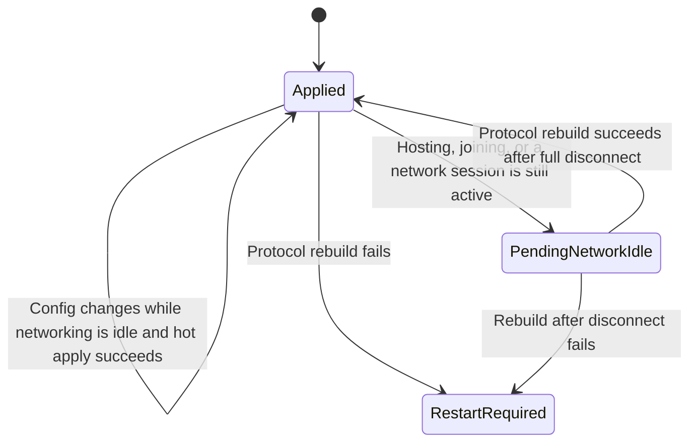

**🌐[ [中文](JML_OptionalNetworkFeatures.md) | English ]**

# JML Optional Network Features

Optional network features are intended for MODs that contain both fully local single-player behavior and a group of network features that should participate in the multiplayer protocol only when the user explicitly enables them. When the network feature is disabled, those message types alone no longer make the MOD affect multiplayer. When enabled, JML includes it in the game's gameplay-MOD compatibility checks.

This is not a general-purpose hot-unload mechanism. The current abstraction manages `INetMessage` sets, the gameplay-MOD flag, and the corresponding runtime protocol state.

---

## 1. State Model



The config field expresses the user's requested state. The handle's `EffectiveEnabled` property expresses the state actually used by the current protocol. They can differ while waiting for disconnect or after an apply failure, so handler registration, message sending, and feature entry points must use only `EffectiveEnabled`.

---

## 2. Manifest and Scope

The child MOD's initial manifest must keep:

```json
{
  "id": "MyMod",
  "dependencies": [
    {
      "id": "JmcModLib",
      "min_version": "1.6.1"
    }
  ],
  "affects_gameplay": false
}
```

When an optional network feature becomes effective, JML promotes its owning MOD to gameplay-affecting for the current runtime and adds a compatibility identity derived from `ModId`, feature `Id`, and `CompatibilityVersion` to the game's gameplay-MOD list. Disabling it removes that feature's messages and identity.

If the MOD contains other content that always affects gameplay, its manifest should remain `affects_gameplay=true`, and that MOD should not declare this API. The manager rejects declarations whose initial manifest flag is `true` because it cannot downgrade the whole MOD. Optional network features are also not suitable for models, save schemas, or other global registrations that cannot be rebuilt safely.

---

## 3. Declare the Config, Marker, and Messages

Each feature needs an exclusive marker interface. The marker must inherit `INetMessage`; every concrete message owned by that feature implements it, and it must not be shared or overlap with another optional feature.

```csharp
using JmcModLib.Config;
using JmcModLib.Config.UI;
using JmcModLib.Multiplayer;
using MegaCrit.Sts2.Core.Logging;
using MegaCrit.Sts2.Core.Multiplayer.Serialization;
using MegaCrit.Sts2.Core.Multiplayer.Transport;

internal static class OptionalMultiplayerSettings
{
    internal const string FeatureId = "my-mod.multiplayer";

    [UIToggle]
    [Config(
        "Enable Multiplayer Feature",
        group: "multiplayer",
        Key = "multiplayer.enabled",
        Description = "Participate in multiplayer when enabled; keep only local features when disabled.")]
    [OptionalNetworkFeature(
        FeatureId,
        typeof(IMyOptionalNetMessage),
        CompatibilityVersion = "1")]
    public static bool Enabled = false;
}

internal interface IMyOptionalNetMessage : INetMessage;

internal struct MyPingMessage : IMyOptionalNetMessage
{
    public uint Sequence;

    public bool ShouldBroadcast => false;
    public NetTransferMode Mode => NetTransferMode.Reliable;
    public LogLevel LogLevel => LogLevel.Debug;
    public bool ShouldBuffer => false;

    public void Serialize(PacketWriter writer)
    {
        writer.WriteUInt(Sequence);
    }

    public void Deserialize(PacketReader reader)
    {
        Sequence = reader.ReadUInt();
    }
}
```

The target must be a static `bool` field or property carrying `[Config]`. Do not set `RestartRequired=true` on this config: normal changes are hot-applied by JML or deferred until disconnect. Restart fallback is used only after an actual rebuild failure.

Call `ModRegistry.Register` from the normal `ModInitializer` so the declaration is scanned during startup. Registration after the game's base protocol has initialized is rejected and fails closed; this API is not a way to add new message types late at runtime.

Keep `Id` stable after release. Increment `CompatibilityVersion` whenever message layout, message semantics, or the handshake flow changes incompatibly.

---

## 4. Query the Handle and Drive Runtime Behavior

The handle is available after `ModRegistry.Register` completes Attribute scanning:

```csharp
private static OptionalNetworkFeatureHandle? multiplayerFeature;

public static void Initialize()
{
    ModRegistry.Register<MainFile>();

    multiplayerFeature =
        OptionalNetworkFeatures.Get<MainFile>(OptionalMultiplayerSettings.FeatureId);
    multiplayerFeature.EffectiveEnabledChanged += OnEffectiveEnabledChanged;

    ApplyEffectiveState(multiplayerFeature);
}

private static void OnEffectiveEnabledChanged(OptionalNetworkFeatureHandle handle)
{
    ApplyEffectiveState(handle);
}

private static void ApplyEffectiveState(OptionalNetworkFeatureHandle handle)
{
    if (handle.EffectiveEnabled)
    {
        RegisterNetworkHandlers();
    }
    else
    {
        UnregisterNetworkHandlers();
        CancelPendingMultiplayerWork();
    }
}
```

Every send path should defend itself too:

```csharp
if (multiplayerFeature?.EffectiveEnabled != true)
{
    return;
}

netService.SendMessage(new MyPingMessage { Sequence = sequence });
```

Subscribe to `StateChanged` and read `RequestedEnabled`, `ApplyState`, and `HasPendingApply` when UI or logs need to represent a saved-but-not-yet-effective change. If you only need to register or unregister handlers, `EffectiveEnabledChanged` is sufficient.

---

## 5. Hot Apply and Restart Fallback

| Situation | Behavior |
|---|---|
| No host startup, join flow, or established session is active | Rebuild the message table at the next safe main-thread point and apply immediately |
| A host is starting, a room is being joined, or the game is in a lobby/run | Save the config, retain the old protocol, and report `PendingNetworkIdle` |
| Current network activity fully disconnects | Automatically apply the last requested state |
| Message-table rebuild or a safety check fails | Roll back to the previous effective protocol, report `RestartRequired`, and reuse JML's `GameRestart` confirmation flow |

JML never swaps the protocol inside an active session because current and later-joining peers must observe the same message table. Multiple edits are coalesced into the last requested state.

`RestartRequired` means hot apply failed; it does not mean ordinary changes always require a restart. The runtime keeps the previous `EffectiveEnabled` value after failure, so business code remains safe when it follows the handle.

---

## 6. Public API Quick Reference

| API | Purpose |
|---|---|
| `OptionalNetworkFeatureAttribute` | Binds a static bool config to a feature ID, exclusive message marker, and compatibility version |
| `OptionalNetworkFeatures.Get(id, assembly)` | Gets a feature handle from an Assembly; throws when missing |
| `OptionalNetworkFeatures.Get<TOwner>(id)` | Gets a handle using the type's Assembly |
| `OptionalNetworkFeatures.TryGet(id, out handle, assembly)` | Attempts to query a handle |
| `OptionalNetworkFeatureHandle.RequestedEnabled` | State requested by the user's config |
| `OptionalNetworkFeatureHandle.EffectiveEnabled` | State actually used by the current protocol; the only source for business decisions |
| `OptionalNetworkFeatureHandle.ApplyState` | `Applied`, `PendingNetworkIdle`, or `RestartRequired` |
| `OptionalNetworkFeatureHandle.HasPendingApply` | Whether the request or apply state is still incomplete |
| `StateChanged` | Raised when any public state changes |
| `EffectiveEnabledChanged` | Raised when the effective enablement really changes |

See the [API Reference](JML_API_Reference_en.md#17-multiplayer-optional-network-features) for member-level details and [JmcModLibDemo](https://github.com/JMC-Mods/SlayTheSpire2_JmcModLibDemo/blob/main/Core/DemoOptionalNetworkFeature.cs) for a runnable example.

---

## 7. Integration Checklist

- The initial manifest uses `affects_gameplay=false`, and the MOD has no other always-gameplay-affecting content.
- Every feature has a stable, unique `Id` and an exclusive marker interface.
- Every `INetMessage` owned by the feature implements its marker, and no message belongs to two features.
- `[OptionalNetworkFeature]` and `[Config]` are placed on the same static `bool` member.
- Handler registration, handler cleanup, message sending, and business entry points all read `EffectiveEnabled`.
- Disabling through `EffectiveEnabledChanged` cleans up handlers and pending multiplayer work.
- Incompatible protocol changes increment `CompatibilityVersion`.
- Tests cover idle toggles, toggles during multiplayer followed by disconnect, mismatched peer states, and restart fallback after failure.
